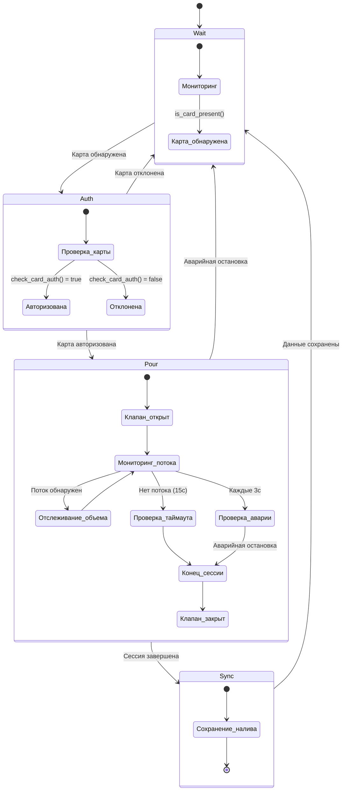

# RPi Controller Internals Documentation

## Overview

Контроллер RPi реализует модульную архитектуру для управления операциями пивного крана с возможностью автономной работы. Система состоит из четырех основных компонентов: FlowManager, DatabaseHandler, HardwareHandler и SyncManager.

## 1. Конечный автомат FlowManager

Класс `FlowManager` реализует ядро конечного автомата для операций разлива пива. Автомат работает в одном методе `process()` с линейной прогрессией состояний.

### Диаграмма состояний



### Реализация состояний

#### 1. Состояние Wait (Ожидание)
```python
if not self.hardware.is_card_present():
    return
```
Система непрерывно мониторит наличие карты через `hardware.is_card_present()`

#### 2. Состояние Auth (Авторизация)
```python
card_uid = self.hardware.get_card_uid()
card_uid = card_uid.replace(" ", "").lower()
if not self.sync_manager.check_card_auth(card_uid):
    # Ожидание удаления карты перед возвратом в Wait
    while self.hardware.is_card_present():
        time.sleep(0.5)
    return
```
- Извлечение UID карты с нормализацией
- Проверка авторизации через backend
- При отклонении - ожидание удаления карты

#### 3. Состояние Pour (Налив)
```python
self.hardware.valve_open()
while self.hardware.is_card_present():
    # Проверка аварийной остановки каждые 3 секунды
    if emergency_check_counter >= 6:
        if self.sync_manager.check_emergency_stop():
            break
    
    # Мониторинг потока каждые 0.5 секунды
    current_volume_ml = int(self.hardware.get_volume_liters() * 1000)
    if current_volume_ml > last_volume_ml:
        total_volume_ml = current_volume_ml
        timeout_counter = 0
    else:
        timeout_counter += 1
    
    # Таймаут 15 секунд при отсутствии потока
    if timeout_counter >= 30:
        break
```
- Открытие клапана
- Мониторинг потока каждые 500мс
- Отслеживание накопленного объема
- Таймаут 15 секунд при отсутствии потока
- Проверка аварийной остановки каждые 3 секунды
- Автоматическое закрытие при удалении карты

#### 4. Состояние Sync (Синхронизация)
```python
if total_volume_ml > 1:  # Минимальный объем 1 мл
    pour_data = {
        "client_tx_id": str(uuid.uuid4()),
        "card_uid": card_uid,
        "tap_id": TAP_ID,
        "start_ts": start_ts,
        "end_ts": end_ts,
        "volume_ml": total_volume_ml,
        "price_cents": int((total_volume_ml / 100.0) * PRICE_PER_100ML_CENTS),
        "price_per_ml_at_pour": float(PRICE_PER_100ML_CENTS / 100.0)
    }
    self.db_handler.add_pour(pour_data)
self.hardware.reset_pulses()
```
- Сохранение данных о наливе при объеме > 1мл
- Генерация уникального `client_tx_id`
- Расчет стоимости на основе `PRICE_PER_100ML_CENTS`
- Сброс счетчика импульсов датчика потока

## 2. Механизм аутентификации X-Internal-Token

Класс `SyncManager` реализует безопасную коммуникацию с backend используя общий секретный токен.

### Использование токена

Все API запросы к backend включают заголовок `X-Internal-Token`:

```python
headers = {"X-Internal-Token": INTERNAL_TOKEN}
```

### Конфигурация в config.py
```python
INTERNAL_TOKEN = os.getenv("INTERNAL_TOKEN", "demo-secret-key").strip()
```

### API эндпоинты с токеном

| Эндпоинт | Метод | Назначение | Требуется токен |
|----------|--------|------------|-----------------|
| `/api/system/status` | GET | Проверка аварийной остановки | Да |
| `/api/sync/pours` | POST | Синхронизация данных наливов | Да |
| `/api/guests` | GET | Проверка авторизации карты | Да |

### Реализация в sync_manager.py

#### Проверка аварийной остановки
```python
def check_emergency_stop(self):
    url = "/".join([self.server_url, "api", "system", "status"])
    headers = {"X-Internal-Token": INTERNAL_TOKEN}
    response = self.session.get(url, headers=headers, timeout=5)
    if response.status_code == 200:
        data = response.json()
        return str(data.get("value", "")).lower() == "true"
```

#### Проверка авторизации карты
```python
def check_card_auth(self, card_uid):
    url = "/".join([self.server_url, "api", "guests"])
    headers = {"X-Internal-Token": INTERNAL_TOKEN}
    response = self.session.get(url, headers=headers, timeout=5)
    if response.status_code == 200:
        guests = response.json()
        for guest in guests:
            cards = guest.get("cards", [])
            if any(card.get("card_uid", "").replace(" ", "").lower() == clean_uid for card in cards):
                return True
```

#### Синхронизация данных
```python
def sync_cycle(self, db_handler):
    payload = {"pours": [dict(row) for row in pours]}
    url = "/".join([self.server_url, "api", "sync", "pours"])
    headers = {"X-Internal-Token": INTERNAL_TOKEN}
    response = self.session.post(url, json=payload, headers=headers, timeout=10)
```

### Соображения безопасности
- Токен настраивается через переменную окружения
- Значение по умолчанию для разработки (в production должен быть изменен)
- Вся межсервисная коммуникация требует валидный токен
- Валидация токена происходит на backend перед обработкой запросов

## 3. Аппаратный уровень абстракции с gpiozero и LGPIOFactory

Класс `HardwareHandler` предоставляет унифицированный интерфейс к физическим компонентам используя современные библиотеки.

### Интеграция с gpiozero

#### Настройка LGPIOFactory
```python
from gpiozero.pins.lgpio import LGPIOFactory
from gpiozero import Device

# Установка LGPIOFactory для gpiozero
Device.pin_factory = LGPIOFactory()
```

#### Управление компонентами
```python
from gpiozero import DigitalInputDevice, OutputDevice

class HardwareHandler:
    def __init__(self):
        # Инициализация реле и датчика потока
        self.relay = OutputDevice(PIN_RELAY)           # Управление клапаном
        self.flow_sensor = DigitalInputDevice(PIN_FLOW_SENSOR)  # Датчик потока
        
        # Установка обработчика прерываний для датчика потока
        self.flow_sensor.when_activated = self._pulse_detected
```

### Преимущества LGPIOFactory над устаревшими библиотеками

| Характеристика | LGPIOFactory | RPi.GPIO (устарел) |
|----------------|-------------|-------------------|
| Совместимость | Raspberry Pi 4/5 | Только старые модели |
| Производительность | Высокая | Низкая |
| Безопасность потоков | Встроенная | Требует ручной реализации |
| Поддержка | Активная | Ограниченная |

### Интеграция с pyscard для NFC

#### Обнаружение карты
```python
from smartcard.System import readers

def is_card_present(self):
    r = readers()
    if not r:
        return False
    connection = r[0].createConnection()
    try:
        connection.connect()
        return True
    except Exception:
        return False
```

#### Извлечение UID
```python
from smartcard.util import toHexString

def get_card_uid(self):
    r = readers()
    if not r:
        return None
    connection = r[0].createConnection()
    try:
        connection.connect()
        apdu = [0xFF, 0xCA, 0x00, 0x00, 0x00]  # Команда для получения UID
        response, sw1, sw2 = connection.transmit(apdu)
        if sw1 == 0x90 and sw2 == 0x00:
            return toHexString(response)
    except Exception:
        pass
    return None
```

### Ключевые методы HardwareHandler

```python
def valve_open() / valve_close()    # Управление реле клапана
def get_volume_liters()             # Конвертация импульсов в объем
def is_card_present()               # Обнаружение NFC карты
def get_card_uid()                  # Извлечение UID карты
def reset_pulses()                  # Сброс счетчика импульсов
```

### Расчет объема потока
```python
def get_volume_liters(self):
    with self.lock:
        pulses = self.pulse_count
        self.pulse_count = 0
    # Расчет объема в литрах
    return (pulses / FLOW_SENSOR_K_FACTOR) / 1000
```
Где `FLOW_SENSOR_K_FACTOR = 7.5` для датчика YF-S201.

### Потокобезопасность
```python
from threading import Lock

def _pulse_detected(self):
    with self.lock:
        self.pulse_count += 1
```
Все операции с импульсами защищены `threading.Lock()` для атомарного доступа в многопоточной среде.

## 4. Процесс установки через setup.sh

Скрипт `setup.sh` выполняет полную автоматическую настройку системы на Raspberry Pi.

### Шаг 1: Установка системных пакетов
```bash
sudo apt-get update
sudo apt-get install -y \
    pcscd \
    libccid \
    python3-pyscard \
    python3-gpiozero \
    python3-lgpio \
    build-essential \
    swig \
    libpcsclite-dev \
    pkg-config
```

#### Ключевые зависимости:
- **pcscd**: PC/SC Smart Card daemon для NFC ридеров
- **libccid**: USB Chip/Smart Card Interface Devices драйвер
- **python3-pyscard**: Python библиотека для работы с смарт-картами
- **python3-gpiozero**: Современная библиотека для GPIO
- **python3-lgpio**: Low-level GPIO библиотека для LGPIOFactory
- **build-essential/swig**: Инструменты для компиляции расширений

### Шаг 2: Настройка прав и групп
```bash
sudo usermod -aG plugdev $USER    # Доступ к USB устройствам
sudo usermod -aG lp $USER         # Доступ к принтерам (NFC ридеры)
sudo usermod -aG gpio $USER       # Доступ к GPIO пинам
```

### Шаг 3: Настройка Polkit для pcscd
Создание правил для доступа к NFC ридерам без прав суперпользователя:
```bash
cat <<EOF | sudo tee /etc/polkit-1/rules.d/45-pcscd.rules
polkit.addRule(function(action, subject) {
    if ((action.id == "org.debian.pcsc-lite.access_pcsc" || 
         action.id == "org.debian.pcsc-lite.access_card") &&
        subject.isInGroup("plugdev")) {
        return polkit.Result.YES;
    }
});
EOF
```

### Шаг 4: Настройка служб
```bash
sudo systemctl enable pcscd && sudo systemctl start pcscd
```
Автоматический запуск и активация PC/SC демона для NFC ридеров.

### Шаг 5: Настройка виртуального окружения
```bash
python3 -m venv --system-site-packages venv
source venv/bin/activate
pip install gpiozero pyscard requests
```

#### Особенности `--system-site-packages`:
- Использует системные пакеты (python3-pyscard, python3-gpiozero)
- Устанавливает только недостающие зависимости (requests)
- Обеспечивает совместимость с системными драйверами NFC

### Шаг 6: Финализация
```bash
sudo chown -R $USER:$USER .
echo "Настройка завершена! Перезагрузите систему: sudo reboot"
```

### Требования к перезагрузке
После установки требуется перезагрузка для:
- Применения групп пользователей
- Загрузки модулей ядра
- Активации Polkit правил
- Запуска всех служб в правильном порядке

## 5. Параметры конфигурации

Ключевые значения конфигурации в `config.py`:

```python
# Сетевые настройки
SERVER_URL = "http://192.168.0.106:8000"  # Эндпоинт backend
INTERNAL_TOKEN = "demo-secret-key"        # Токен аутентификации

# Идентификация крана
TAP_ID = 1                                # Уникальный ID крана

# Ценообразование
PRICE_PER_100ML_CENTS = 150               # Цена за 100мл в копейках

# Синхронизация
SYNC_INTERVAL_SECONDS = 15                # Частота фоновой синхронизации

# Аппаратные пины
PIN_RELAY = 18                            # GPIO пин для реле клапана
PIN_FLOW_SENSOR = 17                      # GPIO пин для датчика потока

# Калибровка датчика
FLOW_SENSOR_K_FACTOR = 7.5                # K-фактор для YF-S201
```

## 6. Обработка ошибок и устойчивость

### Сетевая устойчивость
- Все HTTP запросы включают таймауты (5-10 секунд)
- Неудачные попытки синхронизации логируются но не прерывают операции
- Локальная база данных обеспечивает сохранность данных при сетевых сбоях

### Аппаратная безопасность
- Проверка аварийной остановки каждые 3 секунды во время налива
- Автоматическое закрытие клапана при любой ошибочной ситуации
- Таймаут датчика потока предотвращает бесконечный налив

### Целостность данных
- Потокобезопасные операции с базой данных
- Уникальные ID транзакций предотвращают дублирование
- Отслеживание статусов позволяет реализовать логику повторных попыток

## 7. Операционный поток

1. **Запуск**: Инициализация аппаратных компонентов, базы данных, сетевых соединений
2. **Основной цикл**: Непрерывный вызов `flow_manager.process()`
3. **Фоновая синхронизация**: Отдельный поток периодически вызывает `sync_manager.sync_cycle()`
4. **Логирование**: Комплексное логирование для отладки и мониторинга

Эта архитектура обеспечивает надежную автономную работу с последующей консистентностью при восстановлении сетевого подключения.
