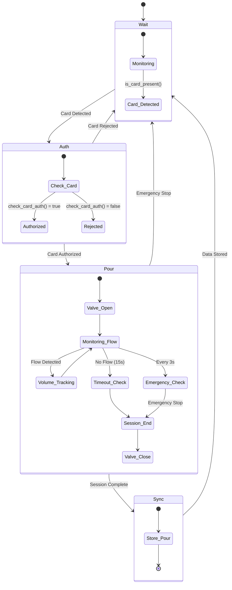

# RPi Controller Internals Documentation

## Overview

The RPi Controller implements a modular architecture for managing beer tap operations with offline-first capabilities. The system consists of four main components: FlowManager, DatabaseHandler, HardwareHandler, and SyncManager.

## Architecture Components

### 1. FlowManager State Machine

The `FlowManager` class implements the core state machine for beer dispensing operations. It follows a linear state progression:

#### State Diagram



#### State Transitions

1. **Wait State**: System continuously monitors for card presence using `hardware.is_card_present()`
2. **Auth State**: 
   - Extracts card UID using `hardware.get_card_uid()`
   - Normalizes UID (removes spaces, converts to lowercase)
   - Validates card against backend via `sync_manager.check_card_auth()`
   - If rejected, waits for card removal before returning to Wait
3. **Pour State**:
   - Opens valve via `hardware.valve_open()`
   - Monitors flow sensor every 500ms
   - Tracks volume accumulation
   - Implements 15-second timeout for no flow
   - Checks emergency stop every 3 seconds
   - Closes valve on card removal, timeout, or emergency stop
4. **Sync State**:
   - Records pour session data if volume > 1ml
   - Stores transaction in local database with 'new' status
   - Resets flow sensor pulses

### 2. SQLite Database Schema

The system uses SQLite with WAL (Write-Ahead Logging) mode for concurrent access safety.

#### Database Configuration
```python
PRAGMA journal_mode=WAL;
```

#### 'pours' Table Schema

| Column | Type | Description | Default |
|--------|------|-------------|---------|
| client_tx_id | TEXT (PRIMARY KEY) | Unique transaction identifier | - |
| card_uid | TEXT | NFC card UID | - |
| tap_id | INTEGER | Tap identifier | - |
| start_ts | TEXT | ISO format start timestamp | - |
| end_ts | TEXT | ISO format end timestamp | - |
| volume_ml | INTEGER | Dispensed volume in milliliters | - |
| price_cents | INTEGER | Cost in cents | - |
| status | TEXT | Transaction status | 'new' |
| attempts | INTEGER | Sync retry count | 0 |
| price_per_ml_at_pour | REAL | Price per ml at pour time | - |

#### Status Lifecycle

1. **new**: Initial status when pour is recorded locally
2. **confirmed**: Successfully synced with backend
3. **failed**: Sync rejected by backend (with reason logged)

#### Thread Safety
All database operations use threading.Lock() to ensure atomic access in the multi-threaded environment.

### 3. Hardware Abstraction Layer

The `HardwareHandler` class provides a unified interface to physical components using two main libraries:

#### gpiozero Integration
- **Pin Factory**: Uses `LGPIOFactory` for Raspberry Pi GPIO control
- **Relay Control**: `DigitalOutputDevice` for valve actuation
- **Flow Sensor**: `DigitalInputDevice` with interrupt-driven pulse counting

#### pyscard Integration
- **Card Detection**: `smartcard.System.readers()` for NFC reader access
- **UID Extraction**: APDU command `[0xFF, 0xCA, 0x00, 0x00, 0x00]` for card identification
- **Error Handling**: Graceful fallback when no card or reader is present

#### Key Methods

```python
def valve_open() / valve_close()    # Relay control
def get_volume_liters()             # Pulse-to-volume conversion
def is_card_present()               # Card detection
def get_card_uid()                  # UID extraction
def reset_pulses()                  # Flow sensor reset
```

#### Flow Calculation
```python
volume_liters = (pulse_count / FLOW_SENSOR_K_FACTOR) / 1000
```
Where `FLOW_SENSOR_K_FACTOR = 7.5` for YF-S201 sensor.

### 4. X-Internal-Token Authentication Mechanism

The `SyncManager` implements secure communication with the backend using a shared secret token.

#### Token Usage

All API requests to the backend include the `X-Internal-Token` header:

```python
headers = {"X-Internal-Token": INTERNAL_TOKEN}
```

#### Configuration
```python
INTERNAL_TOKEN = os.getenv("INTERNAL_TOKEN", "demo-secret-key").strip()
```

#### API Endpoints

| Endpoint | Method | Purpose | Token Required |
|----------|--------|---------|----------------|
| `/api/system/status` | GET | Emergency stop check | Yes |
| `/api/sync/pours` | POST | Pour data synchronization | Yes |
| `/api/guests` | GET | Card authorization check | Yes |

#### Security Considerations
- Token is configurable via environment variable
- Default fallback for development (should be changed in production)
- All inter-service communication requires valid token
- Token validation happens on backend before processing requests

## Configuration Parameters

Key configuration values in `config.py`:

```python
SERVER_URL = "http://192.168.0.106:8000"  # Backend endpoint
TAP_ID = 1                                # Unique tap identifier
PRICE_PER_100ML_CENTS = 150               # Pricing (1.50 currency units per 100ml)
SYNC_INTERVAL_SECONDS = 15                # Background sync frequency
PIN_RELAY = 18                            # GPIO pin for relay
PIN_FLOW_SENSOR = 17                      # GPIO pin for flow sensor
FLOW_SENSOR_K_FACTOR = 7.5                # Flow sensor calibration
INTERNAL_TOKEN = "demo-secret-key"        # Authentication token
```

## Error Handling and Resilience

### Network Resilience
- All HTTP requests include timeouts (5-10 seconds)
- Failed sync attempts are logged but don't interrupt operations
- Local database ensures no data loss during network outages

### Hardware Safety
- Emergency stop check every 3 seconds during pour
- Automatic valve closure on any error condition
- Flow sensor timeout prevents infinite pouring

### Data Integrity
- Thread-safe database operations
- Unique transaction IDs prevent duplicates
- Status tracking enables retry logic for failed syncs

## Operational Flow

1. **Startup**: Initialize hardware, database, and network connections
2. **Main Loop**: Continuously call `flow_manager.process()`
3. **Background Sync**: Separate thread periodically calls `sync_manager.sync_cycle()`
4. **Logging**: Comprehensive logging for debugging and monitoring

This architecture ensures reliable offline operation with eventual consistency when network connectivity is restored.
