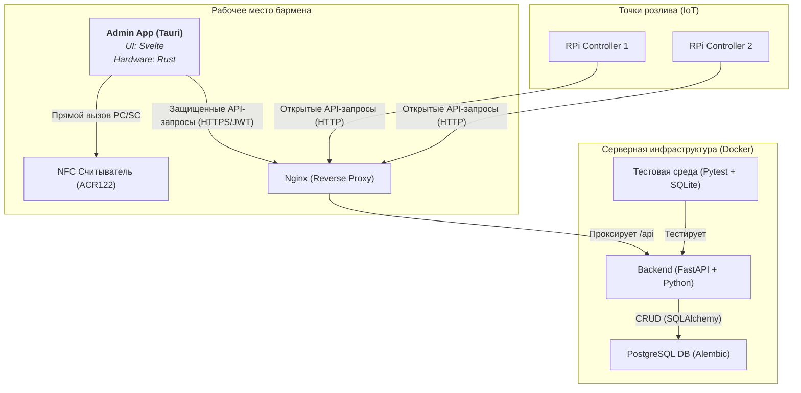
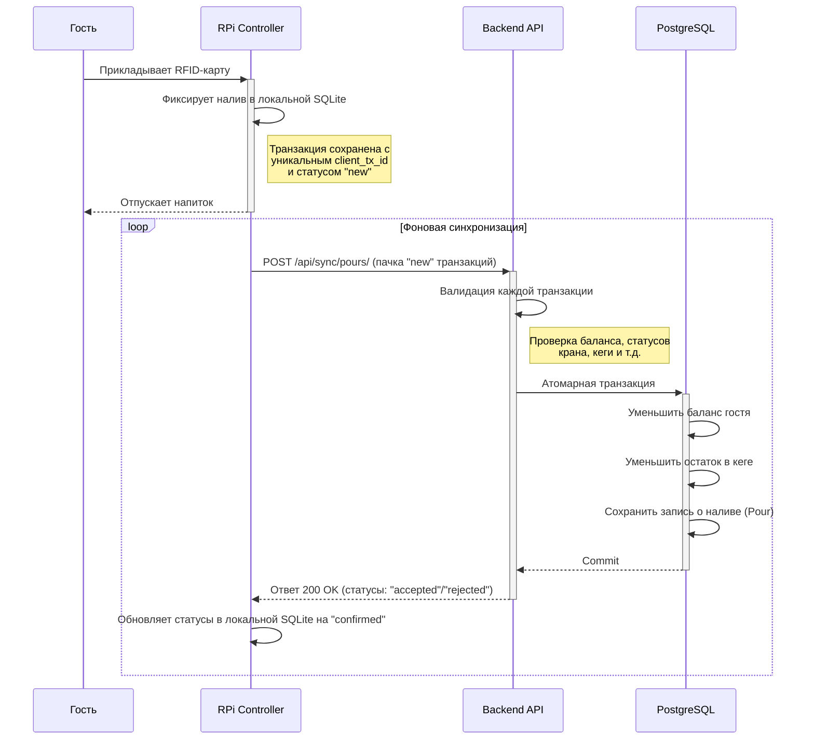

# Техническая документация: Проект "Бар самообслуживания" (MVP v1.0)

**Документ по состоянию на:** 14 октября 2025 г.
**Версия:** 1.0
**Источник истины:** [glebkovalerenko-ui/beer-tap-system.git](https://github.com/glebkovalerenko-ui/beer-tap-system.git)

---

### **Как использовать этот документ с ИИ-ассистентом**

Этот документ структурирован для эффективного взаимодействия с ИИ-ассистентами. Используйте следующие под-промты для получения быстрых и точных результатов:

-   «На основе раздела *J. Тестирование и критерии приёмки* из `mvp-bar-instruction_v1.0.md`, составь детальный тест-план для проверки функционала пополнения баланса гостя.»
-   «На основе разделов *F.6 Admin App* и *N.1 API Overview*, сгенерируй техническое задание на разработку UI-компонента для управления кранами (`Taps`).»
-   «Составь перечень оборудования для закупки из раздела *E. Оборудование (BOM)* с текущими ценами и ссылками на поставщиков в России.»
-   «Сделай пошаговый чек-лист для деплоя серверной части проекта из раздела *L. Руководство Quick Start*.»
-   «Подготовь PRD (Product Requirements Document) для второй версии проекта (v2.0), основываясь на разделе *M. План развития после MVP*.»

---

### **A. Введение**

Настоящий документ является единым и исчерпывающим источником технической информации по проекту "Бар самообслуживания" (MVP v1.0). Он предназначен для инженеров, технических менеджеров и ИИ-ассистентов, участвующих в разработке, поддержке и дальнейшем развитии системы. Документ объединяет в себе все архитектурные решения, принятые в ходе проектирования, и отражает фактическое состояние кодовой базы в репозитории.

### **B. Концепция и цели MVP**

**Beer Tap System** — это аппаратно-программный комплекс для бара самообслуживания, построенный по принципу **локальной работы (local-first / offline-capable)**.

**Ключевые цели MVP:**
1.  **Автономность:** Система должна продолжать обслуживать гостей (регистрировать наливы) даже при временном отсутствии связи с центральным сервером.
2.  **Надежность:** Все финансовые и инвентарные операции должны быть транзакционно-целостными, чтобы исключить потерю данных или денег.
3.  **Простота развертывания:** Вся серверная часть системы должна разворачиваться одной командой для обеспечения воспроизводимости окружения.
4.  **Базовый функционал:** Реализовать основной цикл: регистрация гостя -> привязка RFID-карты -> пополнение баланса -> налив напитка -> корректное списание средств и уменьшение остатков.
5.  **Управляемость:** Предоставить администратору/бармену базовый интерфейс для управления ключевыми сущностями: гостями, кегами, кранами.

### **C. Архитектура**

#### **C.1 Общая архитектурная схема**

Система состоит из трех основных компонентов: **Backend API** (серверная логика), **Admin App** (десктопное приложение для персонала) и **RPi Controller** (устройство управления краном).



#### **C.2 Поток данных: Синхронизация налива**

Это ключевой процесс, обеспечивающий offline-first функциональность.



### **D. Анализ репозитория и кода**

-   **Ссылка:** [https://github.com/glebkovalerenko-ui/beer-tap-system.git](https://github.com/glebkovalerenko-ui/beer-tap-system.git)
-   **Структура:**

```
/
├── admin-app/         # Tauri + Svelte десктопное приложение для персонала [АКТУАЛЬНО]
├── admin-ui/          # React-приложение [УСТАРЕЛО]
├── backend/           # FastAPI бэкенд [АКТУАЛЬНО]
│   ├── alembic/       # Миграции базы данных (Alembic)
│   ├── api/           # Модули API-роутеров (FastAPI Routers)
│   ├── crud/          # Модули с бизнес-логикой (Create, Read, Update, Delete)
│   ├── tests/         # Интеграционные тесты (Pytest)
│   ├── database.py    # Настройка подключения к БД
│   ├── main.py        # Точка входа в приложение, middleware
│   ├── models.py      # Модели данных (SQLAlchemy)
│   ├── schemas.py     # Схемы данных (Pydantic)
│   └── security.py    # Логика аутентификации (JWT)
├── docs/              # Документация проекта (включая этот документ)
├── hardware/          # Спецификации оборудования (BOM)
├── rpi-controller/    # Python-код для Raspberry Pi контроллера
└── docker-compose.yml # Оркестрация серверных сервисов
```

### **E. Оборудование (BOM, схемы, принципы подключения)**

#### **E.1 Bill of Materials (BOM)**

Полный список находится в файле `mvp-bar-bom.csv`.

| Компонент                  | Модель/Тип             | Назначение                                     |
| -------------------------- | ---------------------- | ---------------------------------------------- |
| Контроллер крана           | Raspberry Pi 4 Model B | Управление логикой налива, локальное хранение  |
| RFID Считыватель (Админ)   | ACS ACR122U            | Регистрация и пополнение карт на рабочем месте |
| RFID Считыватель (Кран)    | PN532 (NFC Module)     | Идентификация гостя на точке налива            |
| RFID Карты                 | MIFARE Classic 1K      | Идентификатор гостя                            |
| Электромагнитный клапан    | 12V DC, Normal Closed  | Физическое управление потоком напитка          |
| Датчик потока жидкости     | YF-S201                | Измерение объема налитого напитка              |
| Реле                       | 5V Relay Module        | Управление клапаном с Raspberry Pi             |
| Блок питания               | 12V 5A                 | Питание клапана и других компонентов           |
| Карта памяти               | MicroSD Card 16GB+     | ОС и ПО для Raspberry Pi                       |

#### **E.2 Принципы подключения (RPi Controller)**
`[ПРЕДПОЛОЖЕНИЕ]` Детальная схема отсутствует. Подключение основано на стандартных практиках:
-   **Датчик потока (YF-S201):**
    -   VCC -> 5V (RPi)
    -   GND -> GND (RPi)
    -   Signal -> GPIO Pin (RPi)
-   **Реле:**
    -   VCC -> 5V (RPi)
    -   GND -> GND (RPi)
    -   IN -> GPIO Pin (RPi)
-   **Клапан:** Подключается через реле к внешнему блоку питания 12V.
-   **RFID Считыватель (PN532):** Подключается по I2C или SPI.

### **F. Программная архитектура**

#### **F.1 Backend API (FastAPI)**

-   **Стек:** Python 3.11+, FastAPI, SQLAlchemy 2.0, Pydantic v2, Alembic, PostgreSQL 15.
-   **Архитектурные принципы:**
    -   **Модульность:** Логика разделена на слои: API-роутеры (`api/`), бизнес-логика (`crud/`), модели (`models.py`), схемы (`schemas.py`).
    -   **DI (Dependency Injection):** Активно используется (`Depends`) для получения сессии БД и аутентификации пользователя.
    -   **Асинхронность:** `[ПРЕДПОЛОЖЕНИЕ]` Основные эндпоинты объявлены как `async`, но CRUD-операции являются синхронными из-за драйвера БД.
    -   **Безопасность:** JWT-аутентификация с использованием `python-jose`.
-   **Ключевые файлы:** `backend/main.py` (точка входа, middleware аудита), `backend/database.py` (настройка БД), `backend/security.py` (JWT).

#### **F.2 Admin App (Tauri)**
-   **Стек:** Tauri, Svelte, Rust.
-   **Назначение:** Единое десктотопное приложение для всего персонала.
-   **Структура (`admin-app/`):**
    -   `src/`: Исходный код UI на Svelte.
        -   `lib/api.js`: Централизованный клиент для взаимодействия с Backend API.
        -   `routes/`: Компоненты-страницы.
        -   `App.svelte`: Главный компонент-макет с навигацией.
    -   `src-tauri/`: Исходный код на Rust.
        -   `main.rs`: Точка входа, регистрация Tauri-команд.
        -   **Логика:** Содержит код для прямого взаимодействия с PC/SC (для работы с ACR122U), который вызывается из Svelte.
-   **Ключевая особенность:** Устраняет проблему доступа к USB-устройствам из веба, объединяя веб-технологии (Svelte) и нативный код (Rust) в одном приложении.

#### **F.3 RPi Controller**
-   **Стек:** Python 3, SQLite.
-   **Назначение:** Автономное управление краном.
-   **Структура (`rpi-controller/`):**
    -   `main_controller.py`: Основной цикл программы, опрашивающий RFID-считыватель и датчик потока.
    -   `sync_client.py`: Фоновый поток, отвечающий за периодическую синхронизацию локальных данных о наливах с Backend API.
    -   `local_db.py`: Модуль для работы с локальной базой данных SQLite.
-   **Offline-First Логика:**
    1.  Все наливы немедленно записываются в локальную SQLite со статусом `new`.
    2.  `sync_client` в отдельном потоке пытается отправить все `new` наливы на сервер.
    3.  При успешном ответе от сервера статус локальной записи меняется на `confirmed`.
    4.  Это гарантирует, что ни один налив не будет потерян при сбое сети.

### **G. Процессы взаимодействия компонентов**
См. диаграмму C.2 "Поток данных: Синхронизация налива".

### **H. Настройка и деплой**

#### **H.1 Backend**
Развертывание серверной части полностью автоматизировано с помощью Docker Compose.
1.  Создать файл `.env` в корне проекта на основе `.env.example`.
2.  Выполнить команду: `docker-compose up -d --build`.
3.  Сервис `backend` использует `healthcheck` сервиса `postgres`, чтобы избежать ошибок подключения при старте.

#### **H.2 Admin App**
1.  Перейти в директорию `admin-app/`.
2.  Установить зависимости: `npm install`.
3.  Запустить в режиме разработки: `npm run tauri dev`.
4.  Собрать production-версию: `npm run tauri build`.

#### **H.3 RPi Controller**
1.  Скопировать директорию `rpi-controller/` на Raspberry Pi.
2.  Настроить `config.py`, указав IP-адрес сервера.
3.  Запустить `setup.sh` для установки зависимостей.
4.  Запустить контроллер: `python3 main_controller.py`.

### **I. Безопасность и fault-tolerance**

-   **Аутентификация:** Все административные эндпоинты защищены JWT-токенами.
-   **Аудит:** Все изменяющие (`POST`, `PUT`, `DELETE`) операции автоматически логируются в `AuditLog` через Middleware.
-   **Отказоустойчивость:** Архитектура `offline-first` контроллера является ключевым элементом отказоустойчивости.
-   **Идемпотентность:** Ключевые операции (синхронизация наливов, назначение кеги) являются идемпотентными.

### **J. Тестирование и критерии приёмки**

-   **Система:** Интеграционное тестирование на основе `pytest` и `TestClient`.
-   **База данных:** Тесты используют **изолированную SQLite в оперативной памяти** для скорости и чистоты.
-   **Запуск:** `pip install -r backend/requirements-test.txt && pytest backend/`
-   **Ключевые сценарии (`backend/tests/test_business_lifecycles.py`):**
    1.  **Инвентарный цикл:** Создание напитка -> кеги -> крана -> назначение кеги на кран -> снятие кеги.
    2.  **Финансовый цикл:** Создание гостя -> карты -> привязка карты -> пополнение баланса.

### **K. Известные проблемы и решения**

В ходе разработки был решен ряд ключевых технических проблем, что привело к улучшению архитектуры:
-   **Проблема:** `DetachedInstanceError` в SQLAlchemy при доступе к связанным объектам.
    -   **Решение:** Внедрен **принцип "жадной загрузки" (Eager Loading)** с использованием `options(joinedload(...))` во всех CRUD-операциях.
-   **Проблема:** Тесты падали на SQLite из-за использования PostgreSQL-специфичных функций UUID.
    -   **Решение:** Генерация UUID перенесена из БД в приложение (`default=uuid.uuid4`), сделав модели **база-агностическими**.
-   **Проблема:** Невозможность протестировать приложение, так как импорт `main.py` пытался подключиться к БД.
    -   **Решение:** Создание схемы БД (`create_all`) было полностью удалено из кода приложения и вынесено в миграции (для production) и тестовые фикстуры.

### **L. Руководство Quick Start**

1.  **Клонировать репозиторий:**
    `git clone https://github.com/glebkovalerenko-ui/beer-tap-system.git`
2.  **Настроить окружение:**
    `cd beer-tap-system && cp .env.example .env` (отредактировать `.env`).
3.  **Запустить сервер:**
    `docker-compose up -d --build`
4.  **Запустить Admin App:**
    `cd admin-app && npm install && npm run tauri dev`
5.  **Настроить и запустить контроллер:**
    См. раздел H.3.

### **M. План развития после MVP**

-   **Отчетность и аналитика:** Разработка API и UI для построения отчетов по продажам, популярности напитков, активности гостей.
-   **Управление сменами:** Реализация функционала открытия/закрытия смены с привязкой отчетов к конкретным сменам.
-   **Расширенное управление гостями:** Программы лояльности, скидки, группы гостей.
-   **Интеграция с платежными системами:** Прямое пополнение баланса через банковские терминалы.
-   **CI/CD:** Настройка автоматической сборки, тестирования и деплоя.

### **N. Приложения**

#### **N.1 API Overview**

| Метод  | Путь                                  | Назначение                       | Защита |
| ------ | ------------------------------------- | -------------------------------- | ------ |
| POST   | `/api/token`                          | Получение JWT-токена             | **Нет**    |
| POST   | `/api/sync/pours/`                    | Синхронизация наливов            | **Нет**    |
| POST   | `/api/controllers/register`           | Регистрация контроллера          | **Нет**    |
| GET    | `/api/system/state`                   | Получение глобального состояния  | **Нет**    |
| ...    | ...                                   | ...                              | ...    |
| POST   | `/api/guests/`                        | Создание гостя                   | **Да**     |
| POST   | `/api/guests/{guest_id}/topup`        | Пополнение баланса               | **Да**     |
| POST   | `/api/guests/{guest_id}/cards`        | Привязка карты к гостю           | **Да**     |
| GET    | `/api/guests/{guest_id}/history`      | История операций гостя           | **Да**     |
| POST   | `/api/kegs/`                          | Создание кеги                    | **Да**     |
| PUT    | `/api/taps/{tap_id}/keg`              | Назначение кеги на кран          | **Да**     |
| GET    | `/api/audit/`                         | Получение журнала аудита         | **Да**     |

#### **N.2 Ключевые схемы Pydantic**

См. отчеты по фазам 2.2, 2.3, 2.4.

### **O. Changelog и ссылки на коммиты**

См. отдельный файл `changelog.md`.