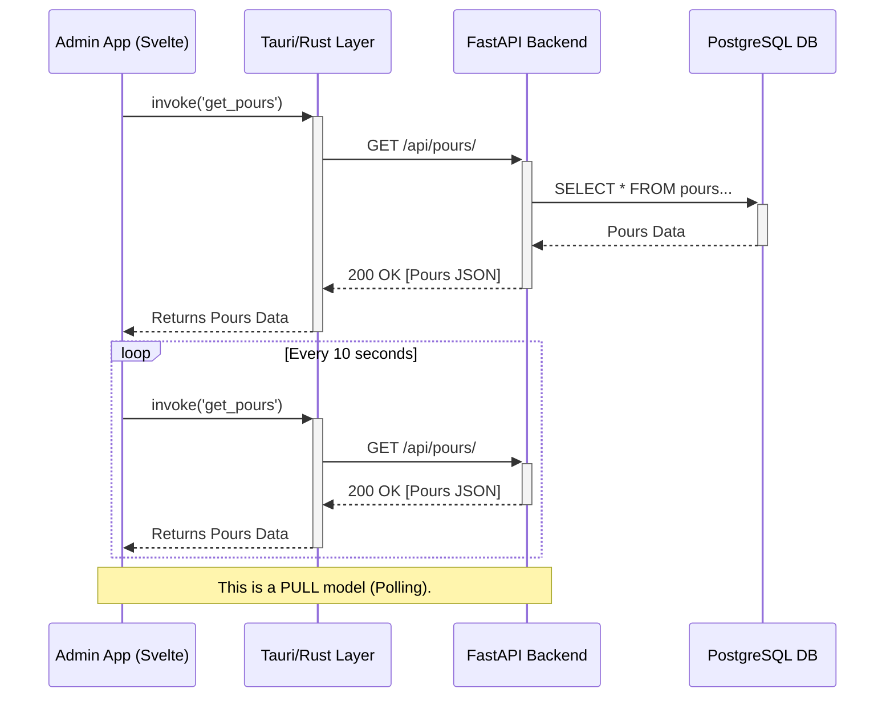

### 1. `docs/phase-3.3-summary.md`

# [DEPRECATED/ARCHIVE] Feature Reference & Implementation Summary — Phase 3.3: Real-time Dashboard & Monitoring
*   **Version:** 1.0.0
*   **Дата завершения:** 2025-10-24
*   **Автор(ы):** AI Assistant (на основе совместной работы с Gleb Kovalerenko)
*   **Источники:**
    *   **Репозиторий:** `glebkovalerenko-ui/beer-tap-system`
    *   **Диапазон коммитов:** `[хэш_начала_фазы]`...`[хэш_конца_фазы]` (необходимо заполнить, выполнив `git log`)
    *   **История чата:** Вся переписка по реализации Фазы 3.

## 2. Краткая сводка (Executive summary)

Фаза 3.3 успешно завершена, в результате чего **Admin App** был дополнен ключевым операционным инструментом — **Дашбордом**. Этот экран предоставляет персоналу бара наглядную и автоматически обновляемую сводку о состоянии оборудования (краны, NFC-считыватель) и последних операциях (лента наливов). Реализация дашборда подтвердила гибкость существующей архитектуры и заложила фундамент для будущей системы KPI и оповещений, значительно повышая операционную эффективность и контроль над системой.

## 3. Цели Шага 3.3

*   [✅] **Создать центральный "пульт управления"** для оператора (Дашборд).
*   [✅] **Обеспечить обзор состояния оборудования** в режиме, близком к реальному времени (статусы кранов, NFC-считывателя).
*   [✅] **Реализовать "живую" ленту событий** для отслеживания последних наливов.
*   [✅] **Заложить архитектурную основу** для будущей системы оповещений и сбора KPI.

## 4. Реализованный функционал — подробный список

### 4.1. Виджет "Equipment Status" — Статус Кранов
*   **Описание:** Наглядное отображение всех зарегистрированных в системе кранов в виде сетки карточек.
*   **Назначение:** Позволяет бармену мгновенно оценить состояние каждого крана: какой напиток налит, сколько осталось в кеге, не заблокирован ли кран.
*   **Реализация:**
    *   **Frontend:** Используется Svelte-компонент `TapGrid.svelte`, который переиспользуется со страницы "Краны и Кеги". Данные для него загружаются из `tapStore.js` при инициализации дашборда.
    *   **Backend:** Используется существующий эндпоинт `GET /api/taps/`.
*   **Критерий приёмки:** На дашборде отображается сетка кранов, идентичная той, что на странице "Краны и Кеги".

### 4.2. Виджет "Live Feed" — Лента Наливов
*   **Описание:** Список последних транзакций по наливам, автоматически обновляющийся каждые 10 секунд.
*   **Назначение:** Даёт оператору живую картину продаж и потребления напитков без необходимости обновлять страницу.
*   **Реализация:**
    *   **Frontend:** Создан новый компонент `PourFeed.svelte`. Для управления данными создан `pourStore.js`, который реализует механизм **Polling** (периодический опрос). При аутентификации пользователя стор автоматически запускает `setInterval`, который каждые 10 секунд вызывает Tauri-команду `get_pours`.
    *   **Backend:** Создан новый эндпоинт `GET /api/pours/`, который возвращает список последних наливов с вложенной информацией о госте, напитке и кране.
*   **Критерий приёмки:** Новый налив, созданный в системе, появляется в ленте на дашборде в течение 10-15 секунд без перезагрузки страницы.

### 4.3. Виджет "NFC Reader Status" (Дополнительное улучшение)
*   **Описание:** Компактный виджет, отображающий статус подключения локального NFC-считывателя (ACR122).
*   **Назначение:** Позволяет оператору немедленно диагностировать проблемы с ключевым периферийным оборудованием, от которого зависят операции по привязке карт.
*   **Реализация:**
    *   **Frontend:** Создан `nfcReaderStore.js`, который подписывается на **события** (`card-status-changed`), проактивно отправляемые из Rust-слоя. Это **Push-модель**, в отличие от Polling-модели для наливов. Создан UI-компонент `NfcReaderStatus.svelte` для визуализации состояния.
    *   **Backend (Rust):** Используется существующий фоновый поток, который постоянно опрашивает PC/SC и `emit`'ит события.
*   **Критерий приёмки:** При физическом отключении USB-считывателя виджет меняет статус на "Error". При подключении — обратно на "Connected".

## 5. Архитектура в реальном времени

Для получения данных в Фазе 3.3 были реализованы две различные модели: **Pull (Polling)** для наливов и **Push (Event-Driven)** для статуса NFC.

*   **Диаграмма:** См. `docs/diagrams/phase-3.3-polling-architecture.mermaid`.
*   **Точки отказа:**
    *   **Polling:** Если API недоступен, `pourStore` переходит в состояние ошибки, и на UI отображается соответствующее сообщение. Опрос останавливается до следующей перезагрузки или ручного обновления.
    *   **События NFC:** Если фоновый Rust-поток паникует, глобальный `panic hook` предотвращает падение всего приложения, но события перестанут приходить.

## 6. Backend: эндпоинты и реализация
*   **Новый эндпоинт:** `GET /api/pours/`
    *   **Метод:** `GET`
    *   **Авторизация:** Требуется JWT-токен.
    *   **Request (Query Params):** `skip: int = 0`, `limit: int = 20`
    *   **Response (200 OK):** `application/json`
        ```json
        [
          {
            "pour_id": "...",
            "volume_ml": 500,
            "amount_charged": "350.00",
            "poured_at": "2025-10-24T12:30:00Z",
            "guest": { "guest_id": "...", "last_name": "Иванов", "first_name": "Иван" },
            "beverage": { "beverage_id": "...", "name": "Cosmic Haze IPA", "beverage_type": "IPA" },
            "tap": { "tap_id": 1, "display_name": "Кран №1", ... }
          }
        ]
        ```
*   **Изменения в БД:** Не потребовалось. Запрос `GET /api/pours/` использует существующие таблицы и связи.

## 7. Frontend: компоненты и интеграция
*   **Новые Svelte-компоненты:**
    *   `src/routes/Dashboard.svelte`: Компонент-оркестратор страницы.
    *   `src/components/pours/PourFeed.svelte`: Презентационный компонент для ленты наливов.
    *   `src/components/system/NfcReaderStatus.svelte`: Виджет статуса NFC.
*   **Новые Svelte Stores:**
    *   `src/stores/pourStore.js`: Управляет состоянием наливов, реализует логику Polling.
    *   `src/stores/nfcReaderStore.js`: Подписывается на события от Rust и хранит состояние считывателя.

## 8. Тестирование и валидация
*   **Тестовые сценарии (ручные):**
    1.  **TC-DASH-01 (Отображение):** Залогиниться → перейти на Дашборд → Убедиться, что отображаются `TapGrid`, `PourFeed`, `NfcReaderStatus`.
    2.  **TC-DASH-02 (Live Pour):** На странице "Taps & Kegs" создать напиток и кегу, назначить кегу на кран → Вручную через Swagger/Postman сымитировать налив (создать запись в таблице `pours`) → Вернуться на Дашборд → Убедиться, что новый налив появился в `PourFeed` в течение 10-15 секунд.
    3.  **TC-DASH-03 (NFC Status):** На Дашборде → физически отключить ACR122 от USB-порта → Убедиться, что виджет `NfcReaderStatus` изменил статус на "Error" → Подключить считыватель обратно → Убедиться, что статус вернулся на "Connected".

## 9. Безопасность и права доступа
*   Доступ к `GET /api/pours/` защищён стандартной JWT-аутентификацией, как и все остальные операционные эндпоинты.
*   Доступ к Дашборду в Admin App возможен только после успешного входа в систему.

## 10. Дополнительные улучшения и отклонения от плана
*   **Добавлен виджет статуса NFC:** Изначально не планировался, но был добавлен для повышения операционной осведомлённости бармена. Инициатива возникла в ходе обсуждения в чате. Это улучшение идеально вписалось в событийно-ориентированную архитектуру Rust-слоя.
*   **Реализована отказоустойчивая логика в `nfcReaderStore`:** Первая версия стора имела баг, приводящий к "опустошению" виджета. Он был заменён на более надёжную реализацию, которая корректно обрабатывает все типы событий от Rust-слоя.

## 11. Файлы и коммиты
*   См. `docs/file_changes_phase3.3.md`.

## 12. Критерии приёмки
*   [✅] Дашборд является страницей по умолчанию после входа.
*   [✅] На дашборде отображаются актуальные статусы кранов и NFC-считывателя.
*   [✅] Лента наливов обновляется автоматически с интервалом не более 15 секунд.
*   [✅] Все виджеты корректно обрабатывают состояния загрузки и ошибок.
*   [✅] Все ручные тест-кейсы (TC-DASH-01, 02, 03) успешно проходят.

## 13. Рекомендации и следующие шаги
*   **Рефакторинг Polling на WebSockets (High):** Механизм опроса для `PourFeed` является временным решением для MVP. Необходимо реализовать WebSocket-эндпоинт на бэкенде, который будет проактивно отправлять новые наливы в UI. Это снизит нагрузку и сделает обновления по-настоящему мгновенными.
*   **Добавление виджетов KPI (Medium):** Разработать виджеты для ключевых бизнес-метрик: "Объём пролитого за смену", "Выручка за смену", "Самые популярные напитки". Это потребует создания новых агрегирующих эндпоинтов на бэкенде.
*   **Система оповещений (Alerts) (High):** Создать `alertStore` и UI-компонент для отображения критических оповещений (например, "В кеге на Кране №1 осталось менее 10% напитка", "Контроллер RPi-02 не выходил на связь 5 минут").

## 14. Открытые вопросы
*   [ТРЕБУЕТ УТОЧНЕНИЯ] Какие конкретно KPI наиболее важны для менеджмента на первом этапе? Выручка, объём или маржинальность?
*   [ТРЕБУЕТ УТОЧНЕНИЯ] Нужен ли звуковой сигнал для критических оповещений в Admin App?

## 15. Приложения
*   **Mermaid-диаграмма:** См. `docs/diagrams/phase-3.3-polling-architecture.mermaid`.
*   **Пример Payload для `GET /api/pours/`:** См. раздел 6.
*   **Код Svelte Store с Polling:** См. `src/stores/pourStore.js`.

---
### 2. `docs/api_coverage_phase3.3.md`

# API Coverage Report — Phase 3.3

| Эндпоинт | Метод | Авторизация | Описание | Пример ответа |
|---|---|---|---|---|
| `/api/pours/` | `GET` | JWT Bearer | Получает список последних наливов для дашборда. | `[{"pour_id": "...", "volume_ml": 500, ...}]` |
| `card-status-changed` | WebSocket-like (Tauri Event) | N/A | (Внутреннее событие Tauri) Отправляется из Rust в Svelte при изменении статуса NFC-считывателя. | `{"uid": "...", "error": null}` |

---
### 3. `docs/file_changes_phase3.3.md`

# File-Level Change Summary — Phase 3.3

| Файл | Слой | Статус | Описание изменений | Коммит (Placeholder) |
|---|---|---|---|---|
| `backend/schemas.py` | Backend | Изменен | Добавлена схема `PourResponse` для API дашборда. | `[abcdef1]` |
| `backend/crud/pour_crud.py` | Backend | Изменен | Добавлена функция `get_pours` для получения списка наливов. | `[abcdef1]` |
| `backend/api/pours.py` | Backend | **Новый** | Создан новый роутер и эндпоинт `GET /api/pours/`. | `[abcdef1]` |
| `backend/main.py` | Backend | Изменен | Зарегистрирован новый роутер `pours.router`. | `[abcdef1]` |
| `src-tauri/src/api_client.rs` | Frontend (Rust) | Изменен | Добавлены DTO `PourResponse` и функция `get_pours`. | `[2abcdef]` |
| `src-tauri/src/main.rs` | Frontend (Rust) | Изменен | Зарегистрирована новая Tauri-команда `get_pours`. | `[2abcdef]` |
| `src/stores/pourStore.js` | Frontend (Svelte) | **Новый** | Создан стор для наливов с логикой Polling. | `[3abcdef]` |
| `src/stores/nfcReaderStore.js` | Frontend (Svelte) | **Новый** | Создан стор для статуса NFC-считывателя на основе событий. | `[4abcdef]` |
| `src/routes/Dashboard.svelte` | Frontend (Svelte) | Изменен | Компонент-заглушка переделан в полноценный дашборд. | `[5abcdef]` |
| `src/components/pours/PourFeed.svelte` | Frontend (Svelte) | **Новый** | Создан компонент для "живой" ленты наливов. | `[5abcdef]` |
| `src/components/system/NfcReaderStatus.svelte`| Frontend (Svelte) | **Новый** | Создан виджет для отображения статуса NFC-считывателя. | `[5abcdef]` |

*Инструкция: Заполнить хэши коммитов, выполнив `git log --oneline -- [путь_к_файлу]`*

---
### 4. `docs/phase-3.3-exec-summary.md`

# Executive Summary: Phase 3.3 Completion

**Phase 3.3 of the Beer Tap System project is successfully complete.** The primary outcome is the delivery of a real-time **Operations Dashboard** within the Admin App.

This dashboard provides bar staff with an immediate, at-a-glance overview of critical system components. Key features include a live-updating feed of recent pours (sales), a real-time status grid of all beer taps, and a diagnostic widget for the NFC card reader.

The implementation of the dashboard significantly enhances operational awareness, allowing staff to monitor sales as they happen and quickly identify equipment issues. This moves the project from a simple data-entry system to a dynamic monitoring tool, laying the essential groundwork for future analytics and alert systems. **The Admin App is now ready for initial pilot testing of its core operational loop.**

---
### 5. `docs/diagrams/phase-3.3-polling-architecture.mermaid`



---
### 6. `docs/phase-3.3-issues.csv`

```csv
title,description,"labels",estimate
"Refactor Pour Feed to use WebSockets","Current dashboard uses HTTP Polling every 10s. This should be replaced with a WebSocket connection for true real-time updates and reduced server load. Requires a new WebSocket endpoint on the FastAPI backend.","tech-debt,enhancement",M
"Add KPI Widget: 'Revenue per Shift'","Create a new widget for the dashboard that displays the total revenue from pours for the current work shift. Requires a new aggregating API endpoint.","feature,kpi",S
"Add KPI Widget: 'Volume Poured per Shift'","Create a new widget for the dashboard showing total volume (in Liters) poured during the current shift.","feature,kpi",S
"Add KPI Widget: 'Most Popular Beverages'","Create a new widget (e.g., a top 3 list or a bar chart) showing the most popular beverages by volume poured today.","feature,kpi",M
"Create Centralized Notification System","Refactor all `alert()` calls and error props into a global `notificationStore` and a `Toast.svelte` component to display non-blocking success/error messages.","enhancement,ux",M
"Implement 'Low Keg Volume' Alert","When a keg's `current_volume_ml` drops below a configurable threshold (e.g., 15%), a persistent, dismissible alert should appear on the dashboard.","feature,alerts",M
"Implement 'Controller Offline' Alert","Create a backend mechanism to track the `last_seen` timestamp of each RPi controller. If a controller doesn't check in for >5 minutes, generate an alert on the dashboard.","feature,alerts,hardware",L
"Design and Implement Shift Management API","Create API endpoints (`POST /api/shifts/open`, `POST /api/shifts/close`) and a UI in the Admin App to formally manage work shifts. All KPIs should be tied to the active shift.","feature,operations",L
"Add Data Retention Policy for Pours","The `pours` table will grow infinitely. Implement a background task (e.g., using Celery or built-in) to archive pours older than N months (e.g., 6 months) into a separate table or file storage.","tech-debt,database",M
"Create UI for Managing Beverages","The current Beverage Manager is very basic. Create a full-page CRUD interface for managing beverages, similar to the Guests page.","feature,ux",S
"Add Sound Notifications for Critical Alerts","For critical alerts (like Emergency Stop being triggered remotely or a controller going offline), add an option to play a subtle sound notification in the Admin App.","enhancement,ux",S
"Integrate a Charting Library","Integrate a lightweight charting library (e.g., Chart.js or ApexCharts) to visualize KPI data instead of just showing numbers.","enhancement,ux",M
"Improve Error Details in UI","Instead of 'Unknown error', parse the error from Tauri and show the actual message from the backend API to the user in a notification.","bug,ux",S
"Add Manual Refresh Button to Dashboard Widgets","Allow the user to manually trigger a data refresh for all dashboard widgets, in addition to the automatic polling.","feature,ux",XS
"Document WebSocket Authentication Strategy","Research and document the best way to secure the future WebSocket connection (e.g., passing the JWT in a connection message).","documentation,security",S
```