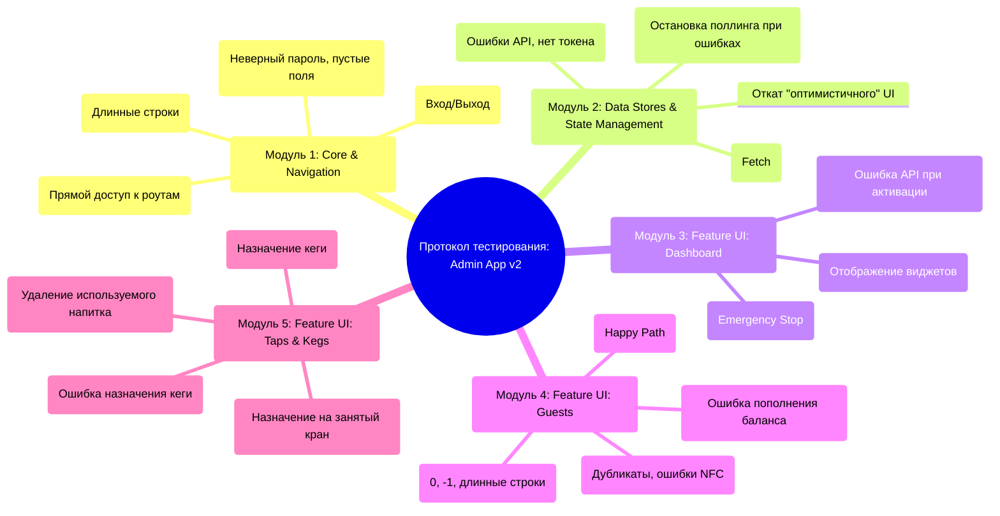

# Протокол приёмочного тестирования: Admin App (v1.0.0) - Версия 2.0 (Расширенная)

## Раздел 1: Введение и мета-информация

### 1.1. Цель документа
Настоящий документ является единым источником правды для проведения ручного приёмочного тестирования `Admin App`. **Версия 2.0** расширяет первоначальный план, добавляя негативные сценарии, проверки граничных значений, переходов состояний и целостности данных с целью выявления не только функциональных ошибок, но и потенциальных архитектурных уязвимостей.

### 1.2. Объекты тестирования
*   **Приложение:** `Admin App`
*   **Версия:** `1.0.0`
*   **Стек:** Tauri / Svelte / Rust
*   **Границы ответственности:** Документ покрывает тестирование всех ключевых модулей приложения.

### 1.3. Легенда и руководство по заполнению
| Поле | Описание |
| :--- | :--- |
| **Статус** | `[ ]` To Do (К выполнению), `[✅]` Pass (Пройден), `[❌]` Fail (Провален), `[⚠️]` Blocked (Заблокирован) |
| **Приоритет** | `P1` (Critical), `P2` (High), `P3` (Medium) |
| **Фактический результат**| Краткая и объективная констатация факта. Для статуса `Pass` можно оставить пустым или написать "Соответствует ОР". Для `Fail` — описать, что пошло не так. |
| **Примечания / Bug ID**| ID задачи из трекера (например, `issue-123`), ссылки на скриншоты, важные наблюдения или комментарии. |

### 1.4. Структура плана тестирования (Mind Map)

---

## Раздел 2: Протокол тестирования

### Модуль 1: Core & Navigation

| ID | Приоритет | Статус | Сценарий (Gherkin) | Фактический результат | Примечания / Bug ID |
| :--- | :--- | :--- | :--- | :--- | :--- |
| TC-CORE-01 | P1 | `[ ]` | **Scenario:** Успешный запуск приложения **Given** Приложение не запущено **When** Пользователь запускает его **Then** Открывается окно приложения и отображается компонент Login | | |
| TC-CORE-02 | P2 | `[ ]` | **Scenario:** Корректное закрытие приложения **Given** Приложение запущено **When** Пользователь нажимает системную кнопку "Закрыть" **Then** Процесс приложения корректно завершается в ОС | | |
| TC-CORE-03 | P1 | `[ ]` | **Scenario:** Успешный вход в систему **Given** Пользователь на экране входа с валидными данными **When** Нажимает "Log In" **Then** Токен сохраняется, происходит редирект на Dashboard | | |
| TC-CORE-04 | P2 | `[ ]` | **Scenario:** (Негативный) Попытка входа с неверным паролем **Given** Пользователь на экране входа **When** Вводит верный логин и неверный пароль **Then** Под формой отображается ошибка, пользователь остается на странице | | |
| TC-CORE-05 | P1 | `[ ]` | **Scenario:** Успешный выход из системы **Given** Пользователь аутентифицирован **When** Нажимает "Log Out" **Then** Токен удаляется из Local Storage, отображается экран входа | | |
| TC-CORE-06 | P1 | `[ ]` | **Scenario:** Восстановление сессии после перезапуска **Given** Пользователь аутентифицирован и токен есть в Local Storage **When** Перезапускает приложение **Then** Сразу видит Dashboard без экрана входа | | |
| TC-CORE-07 | P1 | `[ ]` | **Scenario:** Навигация по приложению **Given** Пользователь аутентифицирован **When** Нажимает на ссылки "Guests" и "Taps & Kegs" **Then** Отображаются корректные страницы | | |
| TC-CORE-08 | P2 | `[ ]` | **Scenario:** Отображение баннера "Emergency Stop" **Given** 'systemStore.emergencyStop' = true **When** UI перерисовывается **Then** Вверху окна появляется глобальный баннер | | |
| TC-CORE-09 | P2 | `[ ]` | **Scenario:** (Негативный) Попытка входа с пустыми данными **Given** Пользователь на экране входа **When** Оставляет поля пустыми и пытается войти **Then** Кнопка "Log In" неактивна или появляется ошибка валидации | | |
| TC-CORE-10 | P3 | `[ ]` | **Scenario:** (Граничный) Попытка входа с очень длинными строками **Given** Пользователь на экране входа **When** Вводит 256+ символов в поля и нажимает "Log In" **Then** Приложение не падает, API корректно обрабатывает запрос | | |
| TC-CORE-11 | P1 | `[ ]` | **Scenario:** (Безопасность) Прямой переход на защищенный роут без аутентификации **Given** Пользователь не аутентифицирован **When** Пытается открыть URL `/#/guests` **Then** Происходит автоматический редирект на страницу входа (`/#/login`) | | |

### Модуль 2: Data Stores & State Management

| ID | Приоритет | Статус | Сценарий (Gherkin) | Фактический результат | Примечания / Bug ID |
| :--- | :--- | :--- | :--- | :--- | :--- |
| TC-STORE-01 | P1 | `[ ]` | **Scenario:** Успешная загрузка данных (Fetch) **Given** Пользователь аутентифицирован **When** Вызывается 'fetchGuests' **Then** 'loading'->'true'->'false', 'guests' заполнен, 'error'->'null' | | |
| TC-STORE-02 | P1 | `[ ]` | **Scenario:** (Негативный) Попытка загрузки данных без токена **Given** Пользователь не аутентифицирован **When** Вызывается 'fetchGuests' **Then** Tauri-команда НЕ вызывается | | |
| TC-STORE-03 | P2 | `[ ]` | **Scenario:** (Негативный) Обработка ошибки API при загрузке **Given** API вернет ошибку **When** Вызывается 'fetchGuests' **Then** 'error' содержит текст ошибки, 'guests' становится `[]` | | |
| TC-STORE-04 | P1 | `[ ]` | **Scenario:** Успешное "оптимистичное" обновление при создании **Given** Стор содержит N элементов **When** 'createGuest' успешно завершается **Then** В сторе N+1 элементов без повторного fetch | | |
| TC-STORE-05 | P2 | `[ ]` | **Scenario:** Поллинг запускается и останавливается с сессией **Given** Пользователь не аутентифицирован **When** Входит, а затем выходит из системы **Then** 'pourStore' запускает/останавливает 'setInterval' | | |
| TC-STORE-06 | P2 | `[ ]` | **Scenario:** Стор реагирует на события (NFC) **Given** 'nfcReaderStore' активен **When** Rust генерирует событие 'card-status-changed' **Then** Состояние 'nfcReaderStore' корректно обновляется | | |
| TC-STORE-07 | P1 | `[ ]` | **Scenario:** (Откат UI) Корректный откат UI при ошибке "оптимистичного" создания **Given** Пользователь инициировал создание сущности, и она появилась в UI **When** API бэкенда возвращает ошибку **Then** Временно добавленная сущность удаляется из стора/UI **And** Стор 'error' заполняется текстом ошибки | | |
| TC-STORE-08 | P2 | `[ ]` | **Scenario:** (Безопасность) Реакция стора на невалидный/истекший токен **Given** Токен в Local Storage истек или невалиден **When** Любой стор пытается выполнить запрос к API **Then** API возвращает ошибку 401/403 **And** 'sessionStore' автоматически выполняет logout | | |
| TC-STORE-09 | P3 | `[ ]` | **Scenario:** (Надежность) Поллинг-стор прекращает запросы после серии ошибок **Given** 'pourStore' активен **When** API начинает возвращать ошибку на 'get_pours' 3 раза подряд **Then** Поллинг останавливается ('clearInterval'), чтобы не спамить бэкенд | | |

### Модуль 3: Feature UI: Dashboard

| ID | Приоритет | Статус | Сценарий (Gherkin) | Фактический результат | Примечания / Bug ID |
| :--- | :--- | :--- | :--- | :--- | :--- |
| TC-DASH-01 | P1 | `[ ]` | **Scenario:** Успешная загрузка и отображение всех виджетов **Given** Пользователь на "Dashboard" **When** Все API-запросы успешны **Then** Отображаются 'NfcReaderStatus', 'TapGrid', 'PourFeed' | | |
| TC-DASH-02 | P2 | `[ ]` | **Scenario:** Отображение состояния загрузки **Given** API отвечают с задержкой **When** Пользователь на "Dashboard" **Then** Отображаются тексты "Loading..." | | |
| TC-DASH-03 | P1 | `[ ]` | **Scenario:** Успешная активация "Emergency Stop" **Given** Система в штатном режиме **When** Пользователь активирует ЧС и подтверждает **Then** Кнопка меняет текст/цвет | | |
| TC-DASH-04 | P1 | `[ ]` | **Scenario:** Успешная деактивация "Emergency Stop" **Given** Система в режиме ЧС **When** Пользователь деактивирует ЧС и подтверждает **Then** Кнопка возвращается в исходное состояние | | |
| TC-DASH-05 | P2 | `[ ]` | **Scenario:** Отмена действия в модальном окне **Given** Открыто модальное окно подтверждения ЧС **When** Пользователь нажимает "Cancel" **Then** Окно закрывается, состояние не меняется | | |
| TC-DASH-06 | P2 | `[ ]` | **Scenario:** (Негативный) Ошибка API при изменении статуса "Emergency Stop" **Given** Пользователь пытается изменить статус ЧС **When** API возвращает ошибку **Then** Модальное окно закрывается, но кнопка не меняет состояние **And** Появляется уведомление об ошибке | | |
| TC-DASH-07 | P3 | `[ ]` | **Scenario:** (Переход состояний) Обновление статуса ЧС, пока открыто модальное окно **Given** У пользователя открыто модальное окно для активации ЧС **When** Другой администратор активирует ЧС удаленно **Then** Модальное окно закрывается, UI дашборда обновляется | | |

### Модуль 4: Feature UI: Guests

| ID | Приоритет | Статус | Сценарий (Gherkin) | Фактический результат | Примечания / Bug ID |
| :--- | :--- | :--- | :--- | :--- | :--- |
| TC-GUEST-01 | P1 | `[ ]` | **Scenario:** Успешная загрузка и ручное обновление списка **Given** Пользователь на странице "Guests" **When** Нажимает "Refresh List" **Then** Список обновляется | | |
| TC-GUEST-02 | P1 | `[ ]` | **Scenario:** Фильтрация списка через поиск **Given** Есть "Иванов" и "Петров" **When** Вводит "Иван" **Then** Остается только "Иванов" | | |
| TC-GUEST-03 | P1 | `[ ]` | **Scenario:** Выбор гостя и отображение деталей **Given** Отображается список **When** Нажимает на гостя **Then** Справа появляется панель 'GuestDetail' | | |
| TC-GUEST-04 | P1 | `[ ]` | **Scenario:** Успешное создание нового гостя **Given** Пользователь на странице "Guests" **When** Нажимает "+ New Guest", заполняет и сохраняет **Then** Новый гость появляется в списке | | |
| TC-GUEST-05 | P1 | `[ ]` | **Scenario:** Успешное редактирование гостя **Given** Открыта панель 'GuestDetail' **When** Нажимает "Edit", изменяет и сохраняет **Then** Данные в UI обновляются | | |
| TC-GUEST-06 | P2 | `[ ]` | **Scenario:** (Негативный) Ошибка API при сохранении гостя **Given** Открыто модальное окно 'GuestForm' **When** API возвращает ошибку при сохранении **Then** Модальное окно НЕ закрывается, внутри отображается ошибка | | |
| TC-GUEST-07 | P1 | `[ ]` | **Scenario:** Успешная привязка RFID-карты **Given** Открыта панель 'GuestDetail' **When** Нажимает "+ Bind Card" и подносит карту **Then** Новая карта появляется в списке у гостя | | |
| TC-GUEST-08 | P2 | `[ ]` | **Scenario:** (Негативный) Ошибка привязки (карта занята) **Given** Карта уже занята **When** API возвращает ошибку 409 **Then** 'NFCModal' показывает ошибку и не закрывается | | |
| TC-GUEST-09 | P1 | `[ ]` | **Scenario:** Успешное пополнение баланса **Given** Открыта панель 'GuestDetail' **When** Нажимает "+ Top Up", вводит сумму и сохраняет **Then** Баланс в UI обновляется | | |
| TC-GUEST-10 | P3 | `[ ]` | **Scenario:** (Граничный) Создание гостя с очень длинным именем **Given** Пользователь в модальном окне 'GuestForm' **When** Вводит 256+ символов в поле имени и сохраняет **Then** Система корректно обрабатывает (сохраняет или выдает ошибку валидации) | | |
| TC-GUEST-11 | P2 | `[ ]` | **Scenario:** (Целостность данных) Создание гостя с дублирующимися данными **Given** В системе есть гость с документом "123456" **When** Пользователь пытается создать нового гостя с тем же номером документа **Then** API возвращает ошибку, которая отображается в модальном окне | | |
| TC-GUEST-12 | P2 | `[ ]` | **Scenario:** (Граничный) Пополнение баланса на 0, отрицательную сумму или нечисловое значение **Given** Открыто модальное окно 'TopUpModal' **When** Вводит "0", "-100" или "abc" и пытается сохранить **Then** Кнопка сохранения неактивна или появляется ошибка валидации | | |
| TC-GUEST-13 | P2 | `[ ]` | **Scenario:** (Негативный) Ошибка NFC-считывателя во время ожидания карты **Given** Открыто модальное окно 'NFCModal' **When** Rust-бэкенд присылает событие об ошибке считывателя **Then** Модальное окно отображает статус ошибки | | |
| TC-GUEST-14 | P1 | `[ ]` | **Scenario:** (Откат UI) Баланс гостя откатывается при ошибке пополнения **Given** Пользователь инициировал пополнение, и баланс в UI оптимистично обновился **When** API возвращает ошибку **Then** Отображаемый баланс гостя в UI возвращается к исходному значению | | |

### Модуль 5: Feature UI: Taps & Kegs

| ID | Приоритет | Статус | Сценарий (Gherkin) | Фактический результат | Примечания / Bug ID |
| :--- | :--- | :--- | :--- | :--- | :--- |
| TC-TAPS-01 | P1 | `[ ]` | **Scenario:** Успешное добавление напитка **Given** Пользователь на странице "Taps & Kegs" **When** Добавляет напиток через 'BeverageManager' **Then** Напиток появляется в списке | | |
| TC-TAPS-02 | P2 | `[ ]` | **Scenario:** (Негативный) Создание кеги при отсутствии напитков **Given** Список напитков пуст **When** Нажимает "+ Add New Keg" **Then** Появляется 'alert', модальное окно не открывается | | |
| TC-TAPS-03 | P1 | `[ ]` | **Scenario:** Успешное создание кеги **Given** Есть напитки **When** Создает кегу через модальное окно **Then** Новая кега появляется в 'KegList' | | |
| TC-TAPS-04 | P1 | `[ ]` | **Scenario:** Успешное назначение кеги на кран **Given** Есть свободный кран и полная кега **When** Назначает кегу на кран **Then** Статусы крана и кеги в UI обновляются | | |
| TC-TAPS-05 | P2 | `[ ]` | **Scenario:** (Негативный) Попытка назначения кеги при отсутствии доступных **Given** Нет полных кег **When** Открывает модальное окно назначения **Then** Отображается сообщение об отсутствии кег | | |
| TC-TAPS-06 | P1 | `[ ]` | **Scenario:** Успешное снятие кеги с крана **Given** К крану привязана кега **When** Снимает кегу с крана **Then** Статусы крана и кеги в UI обновляются | | |
| TC-TAPS-07 | P2 | `[ ]` | **Scenario:** Управление состоянием крана (Lock/Activate/Cleaning) **Given** Кран в одном из состояний **When** Нажимает на кнопку управления **Then** Статус крана в UI корректно меняется | | |
| TC-TAPS-08 | P1 | `[ ]` | **Scenario:** (Откат UI) Откат статусов при ошибке назначения кеги **Given** UI оптимистично обновил статус крана и кеги **When** API возвращает ошибку **Then** Статусы крана и кеги в UI возвращаются к исходным | | |
| TC-TAPS-09 | P2 | `[ ]` | **Scenario:** (Целостность данных) Попытка удаления напитка, который используется в кеге **Given** Напиток "Лагер" используется в кеге #5 **When** Пользователь пытается удалить "Лагер" из 'BeverageManager' **Then** API возвращает ошибку, которая отображается в UI | | |
| TC-TAPS-10 | P2 | `[ ]` | **Scenario:** (Переход состояний) Попытка назначения кеги на занятый или неисправный кран **Given** Кран #1 находится в статусе 'active' или 'cleaning' **When** Пользователь нажимает "Assign Keg" (если кнопка активна) **Then** Система не позволяет выполнить действие | | |
| TC-TAPS-11 | P2 | `[ ]` | **Scenario:** (Переход состояний) Попытка снятия кеги с заблокированного крана **Given** Кран #1 со статусом 'locked', но на нем есть кега **When** Пользователь нажимает "Unassign Keg" **Then** Система позволяет снять кегу (или не позволяет, в зависимости от бизнес-логики) | | |
| TC-TAPS-12 | P2 | `[ ]` | **Scenario:** (Негативный) Ошибка API при изменении статуса крана **Given** Пользователь пытается заблокировать кран **When** API возвращает ошибку **Then** Статус крана в UI не меняется, появляется уведомление | | |

---

## Раздел 3: Итоговая сводка (Summary)

### 3.1. Статистика выполнения

| Статус | Количество |
| :--- | :--- |
| ✅ Pass | |
| ❌ Fail | |
| ⚠️ Blocked | |
| **Всего** | **53** |

### 3.2. Ключевые выводы и рекомендации

*(Здесь тестировщик напишет краткое заключение о качестве объекта тестирования и рекомендации для команды разработки).*