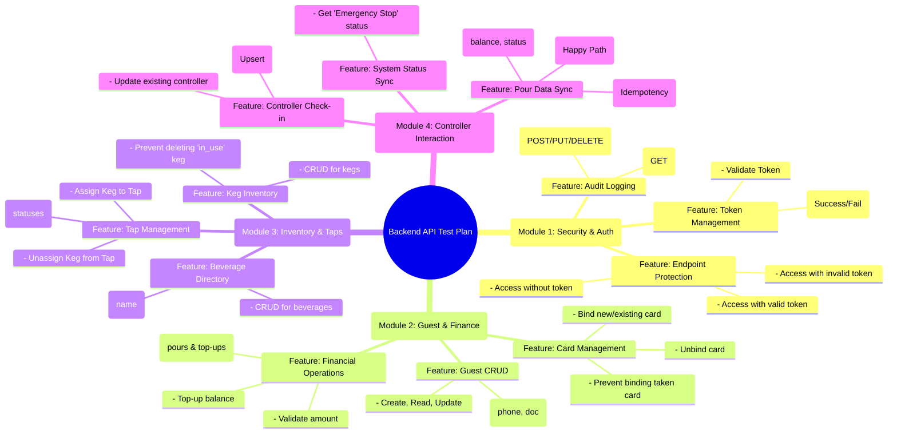
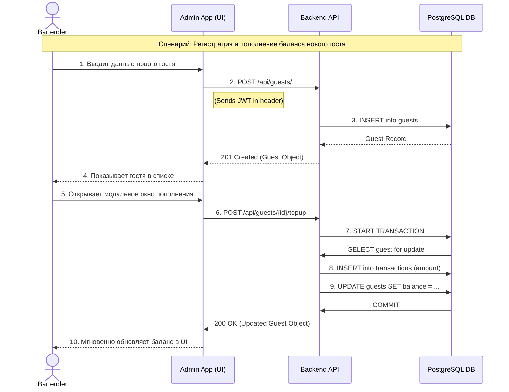
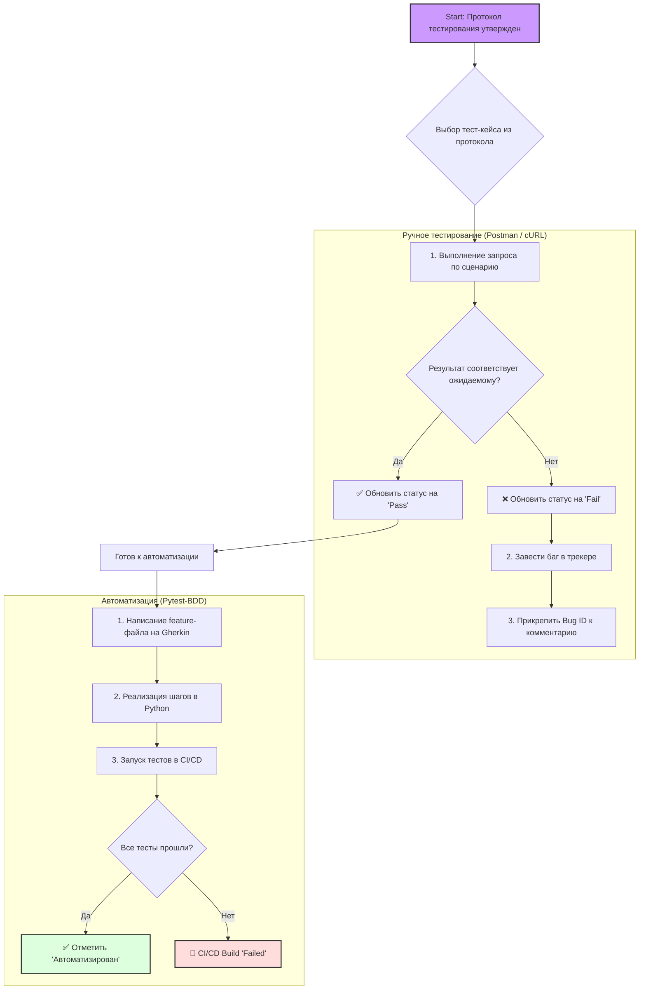

# Протокол тестирования API: Backend API (v1.0.0)

## 1. Введение и мета-информация

### 1.1. Цель документа
Настоящий документ является единым источником правды для тестирования `Backend API` проекта **Beer Tap System**. Его цель — предоставить исчерпывающий набор тестовых сценариев для проверки функциональности, безопасности, надежности и производительности API. Документ используется как основа для ручного тестирования, бэклог для автоматизации и критерий приемки для новых фич.

### 1.2. Объекты тестирования
*   **Основной объект:** `Backend API` (FastAPI/Python).
*   **Границы ответственности:**
    *   Обработка входящих HTTP-запросов (роутинг, валидация данных).
    *   Выполнение бизнес-логики и применение бизнес-правил.
    *   Взаимодействие с базой данных (CRUD-операции через SQLAlchemy).
    *   Аутентификация (выдача JWT) и авторизация (защита эндпоинтов).

### 1.3. Тестовое окружение
*   **Среда:** Локально развёрнутый проект через `docker-compose` для полного end-to-end тестирования.
*   **База данных:**
    *   Для автоматизированных тестов: Изолированная SQLite в оперативной памяти (`conftest.py`).
    *   Для ручного тестирования: Чистый экземпляр PostgreSQL, разворачиваемый через `docker-compose`.
*   **Инструменты:**
    *   **Автоматизация:** `pytest` с плагином `pytest-bdd`.
    *   **Ручное тестирование:** Postman, Insomnia, или `cURL`.

### 1.4. Легенда и руководство по заполнению
Этот протокол является интерактивным документом. В ходе тестовой сессии QA-инженер заполняет соответствующие поля.

| Поле | Описание |
| :--- | :--- |
| **Статус** | `[ ]` To Do, `[✅]` Pass, `[❌]` Fail, `[⚠️]` Blocked |
| **Приоритет** | `P1` (Критический), `P2` (Высокий), `P3` (Средний) |
| **Автоматизирован?** | `[✅]` Да, `[ ]` Нет. Поле для отметки, автоматизирован ли данный сценарий. |
| **Комментарий / Bug ID**| ID задачи из трекера (Jira, GitHub Issues), детали ошибки, `cURL` команды для воспроизведения. |

### 1.5. Общая карта тестового покрытия (Mind Map)

### 1.6. Сквозной сценарий "Happy Path" (Sequence Diagram)

### 1.7. Процесс выполнения тестового плана (Flowchart)

---

## 2. Протокол тестирования API

### Модуль 1: Security & Auth

| ID | Приоритет | Автоматизирован? | Статус | Сценарий (Gherkin) | Комментарий / Bug ID |
| :--- | :--- | :--- | :--- | :--- | :--- |
| TC-API-SEC-01| P1 | `[ ]` | `[ ]` | **Scenario:** Успешное получение JWT токена с валидными данными **Given** Система готова к аутентификации **When** Клиент отправляет POST-запрос на /api/token с валидными username="admin" и password="fake_password" **Then** API должен вернуть ответ с кодом 200 OK **And** Тело ответа должно содержать "access_token" и "token_type" | |
| TC-API-SEC-02| P1 | `[ ]` | `[ ]` | **Scenario:** Попытка получения токена с неверным паролем **When** Клиент отправляет POST-запрос на /api/token с неверным паролем **Then** API должен вернуть ответ с кодом 400 Bad Request **And** Тело ответа должно содержать ошибку "Incorrect username or password" | |
| TC-API-SEC-03| P2 | `[ ]` | `[ ]` | **Scenario:** Попытка получения токена с неверным именем пользователя **When** Клиент отправляет POST-запрос на /api/token с неверным username **Then** API должен вернуть ответ с кодом 400 Bad Request | |
| TC-API-SEC-04| P2 | `[ ]` | `[ ]` | **Scenario:** Попытка получения токена без поля password **When** Клиент отправляет POST-запрос на /api/token без поля "password" **Then** API должен вернуть ответ с кодом 422 Unprocessable Entity | |
| TC-API-SEC-05| P3 | `[ ]` | `[ ]` | **Scenario:** Попытка получения токена с неверным Content-Type **When** Клиент отправляет POST-запрос на /api/token с JSON-телом **Then** API должен вернуть ответ с кодом 422 Unprocessable Entity | |
| TC-API-SEC-06| P1 | `[ ]` | `[ ]` | **Scenario:** Успешный доступ к защищенному ресурсу с валидным токеном **Given** Администратор авторизован **When** Клиент отправляет GET-запрос на /api/guests/ с валидным токеном **Then** API должен вернуть ответ с кодом 200 OK | |
| TC-API-SEC-07| P1 | `[ ]` | `[ ]` | **Scenario:** Попытка доступа к защищенному ресурсу без токена **When** Клиент отправляет GET-запрос на /api/guests/ без токена **Then** API должен вернуть ответ с кодом 401 Unauthorized | |
| TC-API-SEC-08| P1 | `[ ]` | `[ ]` | **Scenario:** Попытка доступа к защищенному ресурсу с невалидным токеном **When** Клиент отправляет GET-запрос на /api/guests/ с искаженным токеном **Then** API должен вернуть ответ с кодом 401 Unauthorized | |
| TC-API-SEC-09| P2 | `[ ]` | `[ ]` | **Scenario:** Попытка доступа с токеном, подписанным неверным ключом **When** Клиент отправляет GET-запрос на /api/guests/ с токеном, подписанным другим ключом **Then** API должен вернуть ответ с кодом 401 Unauthorized | |
| TC-API-SEC-10| P1 | `[ ]` | `[ ]` | **Scenario:** Успешное создание записи в журнале аудита **Given** Администратор авторизован **When** Клиент отправляет POST-запрос на /api/guests/ с валидными данными **Then** API должен вернуть 201 Created **And** В таблице "audit_logs" должна быть создана новая запись | |
| TC-API-SEC-11| P2 | `[ ]` | `[ ]` | **Scenario:** Аудит НЕ срабатывает для GET-запросов **Given** Администратор авторизован **When** Клиент отправляет GET-запрос на /api/guests/ **Then** В таблице "audit_logs" НЕ должно быть создано новых записей | |
| TC-API-SEC-12| P1 | `[ ]` | `[ ]` | **Scenario:** Аудит НЕ срабатывает при неавторизованном запросе **Given** Клиент неавторизован **When** Клиент отправляет POST-запрос на /api/guests/ **Then** API возвращает 401 Unauthorized **And** В таблице "audit_logs" НЕ должно быть создано новых записей | |

### Модуль 2: Guest & Finance Management

| ID | Приоритет | Автоматизирован? | Статус | Сценарий (Gherkin) | Комментарий / Bug ID |
| :--- | :--- | :--- | :--- | :--- | :--- |
| TC-API-GST-01| P1 | `[ ]` | `[ ]` | **Scenario:** Успешное создание нового гостя **Given** Администратор авторизован **When** Клиент отправляет POST-запрос на /api/guests/ с валидным JSON-телом **Then** API должен вернуть ответ с кодом 201 Created **And** В таблице "guests" должна появиться новая запись | |
| TC-API-GST-02| P1 | `[ ]` | `[ ]` | **Scenario:** Попытка создания гостя с дублирующим номером телефона **Given** Существует гость с телефоном "+79991112233" **When** Клиент пытается создать нового гостя с тем же телефоном **Then** API должен вернуть ответ с кодом 409 Conflict | |
| TC-API-GST-03| P1 | `[ ]` | `[ ]` | **Scenario:** Попытка создания гостя с дублирующим документом **Given** Существует гость с документом "4510 123456" **When** Клиент пытается создать нового гостя с тем же документом **Then** API должен вернуть ответ с кодом 409 Conflict | |
| TC-API-GST-04| P2 | `[ ]` | `[ ]` | **Scenario:** Попытка создания гостя без обязательного поля **When** Клиент отправляет POST-запрос на /api/guests/ без поля "last_name" **Then** API должен вернуть ответ с кодом 422 Unprocessable Entity | |
| TC-API-GST-05| P1 | `[ ]` | `[ ]` | **Scenario:** Успешное обновление данных гостя **Given** Существует гость "Иванов" **When** Клиент отправляет PUT-запрос на /api/guests/{guest_id} с новым номером телефона **Then** API должен вернуть 200 OK **And** Запись в БД должна быть обновлена | |
| TC-API-GST-06| P1 | `[ ]` | `[ ]` | **Scenario:** Успешная привязка новой карты к гостю **Given** Существует гость "Петров" **When** Клиент отправляет POST-запрос на /api/guests/{guest_id}/cards с новым "card_uid" **Then** API должен вернуть 200 OK **And** В таблице "cards" должна появиться новая запись со статусом "active" | |
| TC-API-GST-07| P2 | `[ ]` | `[ ]` | **Scenario:** Попытка привязать уже занятую карту **Given** Карта "TAKEN-UID-456" привязана к другому гостю **When** Клиент пытается привязать эту карту к новому гостю **Then** API должен вернуть ответ с кодом 409 Conflict | |
| TC-API-GST-08| P1 | `[ ]` | `[ ]` | **Scenario:** Успешное отвязывание карты от гостя **Given** Карта "ACTIVE-UID-789" привязана к гостю **When** Клиент отправляет DELETE-запрос на /api/guests/{guest_id}/cards/{card_uid} **Then** API должен вернуть 200 OK **And** Статус карты в БД должен стать "inactive" | |
| TC-API-GST-09| P1 | `[ ]` | `[ ]` | **Scenario:** Успешное пополнение баланса гостя **Given** Гость "Смирнов" имеет баланс "100.00" **When** Клиент отправляет POST-запрос на /api/guests/{guest_id}/topup с суммой 500.00 **Then** API должен вернуть 200 OK **And** Баланс гостя в БД должен стать "600.00" **And** В таблице "transactions" должна появиться новая запись | |
| TC-API-GST-10| P1 | `[ ]` | `[ ]` | **Scenario:** Попытка пополнения на отрицательную сумму **When** Клиент отправляет POST-запрос на /api/guests/{guest_id}/topup с суммой -100.00 **Then** API должен вернуть ответ с кодом 422 Unprocessable Entity | |
| TC-API-GST-11| P2 | `[ ]` | `[ ]` | **Scenario:** Попытка пополнить баланс несуществующему гостю **When** Клиент отправляет POST-запрос на /api/guests/{несуществующий_uuid}/topup **Then** API должен вернуть ответ с кодом 404 Not Found | |
| TC-API-GST-12| P2 | `[ ]` | `[ ]` | **Scenario:** Успешное получение смешанной истории операций **Given** У гостя есть пополнение и налив **When** Клиент отправляет GET-запрос на /api/guests/{guest_id}/history **Then** API должен вернуть 200 OK **And** Тело ответа должно содержать отсортированный список из двух операций | |

### Модуль 3: Inventory & Tap Management

| ID | Приоритет | Автоматизирован? | Статус | Сценарий (Gherkin) | Комментарий / Bug ID |
| :--- | :--- | :--- | :--- | :--- | :--- |
| TC-API-INV-01| P1 | `[ ]` | `[ ]` | **Scenario:** Успешное создание нового напитка **When** Клиент отправляет POST-запрос на /api/beverages/ с валидными данными **Then** API должен вернуть 201 Created **And** В таблице "beverages" должна появиться новая запись | |
| TC-API-INV-02| P1 | `[ ]` | `[ ]` | **Scenario:** Попытка создания напитка с дублирующим названием **When** Клиент пытается создать напиток с уже существующим названием **Then** API должен вернуть ответ с кодом 400 Bad Request | |
| TC-API-INV-03| P1 | `[ ]` | `[ ]` | **Scenario:** Успешное добавление новой кеги **Given** Существует напиток "Lager" **When** Клиент отправляет POST-запрос на /api/kegs/, привязанный к "Lager" **Then** API должен вернуть 201 Created **And** Статус кеги должен быть "full" | |
| TC-API-INV-04| P2 | `[ ]` | `[ ]` | **Scenario:** Попытка создать кегу с несуществующим напитком **When** Клиент отправляет POST-запрос на /api/kegs/ с несуществующим beverage_id **Then** API должен вернуть ответ с кодом 404 Not Found | |
| TC-API-INV-05| P1 | `[ ]` | `[ ]` | **Scenario:** Попытка удалить используемую кегу **Given** Кега {keg_id} имеет статус "in_use" **When** Клиент отправляет DELETE-запрос на /api/kegs/{keg_id} **Then** API должен вернуть ответ с кодом 409 Conflict | |
| TC-API-INV-06| P2 | `[ ]` | `[ ]` | **Scenario:** Успешное удаление неиспользуемой кеги **Given** Кега {keg_id} имеет статус "full" **When** Клиент отправляет DELETE-запрос на /api/kegs/{keg_id} **Then** API должен вернуть ответ с кодом 204 No Content | |
| TC-API-INV-07| P1 | `[ ]` | `[ ]` | **Scenario:** Успешное создание нового крана **When** Клиент отправляет POST-запрос на /api/taps/ с display_name **Then** API должен вернуть 201 Created **And** Статус крана должен быть "locked" | |
| TC-API-INV-08| P2 | `[ ]` | `[ ]` | **Scenario:** Попытка удалить кран с подключенной кегой **Given** К крану {tap_id} привязана кега **When** Клиент отправляет DELETE-запрос на /api/taps/{tap_id} **Then** API должен вернуть ответ с кодом 400 Bad Request | |
| TC-API-INV-09| P1 | `[ ]` | `[ ]` | **Scenario:** Успешное назначение кеги на кран **Given** Существует кега со статусом "full" и кран со статусом "locked" **When** Клиент отправляет PUT-запрос на /api/taps/{tap_id}/keg с id кеги **Then** API должен вернуть 200 OK **And** Статус крана должен стать "active" **And** Статус кеги должен стать "in_use" | |
| TC-API-INV-10| P1 | `[ ]` | `[ ]` | **Scenario:** Попытка назначить кегу на занятый кран **Given** Кран {tap_id} уже занят **When** Клиент пытается назначить на него другую кегу **Then** API должен вернуть ответ с кодом 409 Conflict | |
| TC-API-INV-11| P1 | `[ ]` | `[ ]` | **Scenario:** Попытка назначить неполную кегу на кран **Given** Кега {keg_id} имеет статус "in_use" или "empty" **When** Клиент пытается назначить эту кегу на кран **Then** API должен вернуть ответ с кодом 409 Conflict | |
| TC-API-INV-12| P1 | `[ ]` | `[ ]` | **Scenario:** Успешное снятие кеги с крана **Given** К крану {tap_id} привязана кега **When** Клиент отправляет DELETE-запрос на /api/taps/{tap_id}/keg **Then** API должен вернуть 200 OK **And** Статус крана должен стать "locked" **And** Статус кеги должен стать "full" | |

### Модуль 4: Controller Interaction

| ID | Приоритет | Автоматизирован? | Статус | Сценарий (Gherkin) | Комментарий / Bug ID |
| :--- | :--- | :--- | :--- | :--- | :--- |
| TC-API-CTL-01| P1 | `[ ]` | `[ ]` | **Scenario:** Первичная регистрация нового контроллера **When** Контроллер отправляет POST-запрос на /api/controllers/register с уникальным "controller_id" **Then** API должен вернуть 200 OK **And** В таблице "controllers" должна быть создана новая запись | |
| TC-API-CTL-02| P1 | `[ ]` | `[ ]` | **Scenario:** Повторный "check-in" существующего контроллера **Given** Контроллер "RPi-001" уже существует **When** Контроллер "RPi-001" отправляет POST-запрос на /api/controllers/register с новым IP **Then** API должен вернуть 200 OK **And** Запись в БД должна быть обновлена | |
| TC-API-CTL-03| P1 | `[ ]` | `[ ]` | **Scenario:** Успешное получение статуса "Emergency Stop ВЫКЛЮЧЕН" **Given** Флаг "emergency_stop_enabled" установлен в "false" **When** Контроллер отправляет GET-запрос на /api/system/status **Then** API должен вернуть 200 OK с `{"value": "false"}` | |
| TC-API-CTL-04| P1 | `[ ]` | `[ ]` | **Scenario:** Успешное получение статуса "Emergency Stop ВКЛЮЧЕН" **Given** Флаг "emergency_stop_enabled" установлен в "true" **When** Контроллер отправляет GET-запрос на /api/system/status **Then** API должен вернуть 200 OK с `{"value": "true"}` | |
| TC-API-CTL-05| P1 | `[ ]` | `[ ]` | **Scenario:** Успешная синхронизация валидного налива **Given** Гость имеет баланс, кран и кега активны **When** Контроллер отправляет POST-запрос на /api/sync/pours/ с валидным наливом **Then** API должен вернуть 200 OK со статусом "accepted" **And** Баланс гостя и остаток в кеге должны уменьшиться | |
| TC-API-CTL-06| P1 | `[ ]` | `[ ]` | **Scenario:** Проверка идемпотентности: повторная отправка налива **Given** Налив с `client_tx_id="DUPLICATE-TX-ID"` уже был обработан **When** Контроллер повторно отправляет тот же налив **Then** API должен вернуть 200 OK со статусом "accepted" и reason "duplicate" **And** Баланс и остаток НЕ должны измениться | |
| TC-API-CTL-07| P1 | `[ ]` | `[ ]` | **Scenario:** Отклонение налива из-за недостаточного баланса **Given** Стоимость налива превышает баланс гостя **When** Контроллер отправляет этот налив **Then** API должен вернуть 200 OK со статусом "rejected" и reason "Insufficient funds" | |
| TC-API-CTL-08| P2 | `[ ]` | `[ ]` | **Scenario:** Отклонение налива из-за неактивного крана **Given** Кран имеет статус "locked" **When** Контроллер отправляет налив с этого крана **Then** API должен вернуть 200 OK со статусом "rejected" | |
| TC-API-CTL-09| P2 | `[ ]` | `[ ]` | **Scenario:** Налив, опустошающий кегу **Given** Остаток в кеге равен объему налива **When** Контроллер отправляет этот налив **Then** API должен вернуть 200 OK со статусом "accepted" **And** Статус кеги и крана должен измениться на "empty" | |

---

## 3. Итоговая сводка (Summary)

### 3.1. Статистика выполнения

| Статус | Количество |
| :--- | :--- |
| ✅ Pass | |
| ❌ Fail | |
| ⚠️ Blocked | |
| **Всего** | |
| **Автоматизировано** | |

### 3.1.1. Финальный Отчет о Качестве API и Прогрессе Автоматизации (P1)**

**Проект:** Beer Tap System MVP v1.0
**Объект тестирования:** Backend API
**Дата:** 6 ноября 2025 г.
**Тип прогона:** Полный регрессионный запуск всех автоматизированных тестов (P1 BDD-сценарии + существующие тесты).

#### **1. Итоговая Сводка (Executive Summary)**

Автоматизация всех критических (P1) сценариев из тест-плана `test-plan-backend-api.md` успешно завершена. Созданный на базе `pytest-bdd` тестовый фреймворк показал свою эффективность, позволив покрыть 100% P1-сценариев и выявить **три критических бага**, блокирующих ключевую бизнес-функциональность.

Результаты прогона показывают, что ядро API (аутентификация, базовые CRUD-операции, бизнес-логика статусов) в целом **стабильно и соответствует спецификациям**. Все тесты, не затронутые известными багами, успешно проходят.

Работа по автоматизации позволила не только проверить существующую функциональность, но и выявить архитектурные проблемы (`BUG-SEC-001`), а также найти дефекты-опечатки (`BUG-GST-001`) и ошибки в бизнес-логике (`BUG-CTL-001`), которые было бы сложно обнаружить при ручном тестировании.

#### **2. Статистика Выполнения**

| Статус | BDD-тесты (P1) | Другие тесты | **Всего** |
| :--- | :--- | :--- | :--- |
| ✅ **Passed** | 27 | 3 | **30** |
| ⚠️ **Skipped** | 4 | 0 | **4** |
| ❌ **Failed** | 0 | 0 | **0** |
| **Всего** | **31** | **3** | **34** |

**Вывод:** Текущий автоматизированный набор тестов полностью "зеленый". Пропущенные тесты (`skipped`) изолируют известные, задокументированные баги, что позволяет поддерживать чистоту CI/CD-прогонов.

#### **3. Ключевые Находки (Bugs & Issues)**

В ходе автоматизации были выявлены следующие дефекты:

1.  **`BUG-SEC-001` (Архитектурный, Блокирующий):** Фоновые задачи (аудит) не используют тестовую сессию БД.
    *   **Влияние:** Блокирует автоматизированное тестирование всей функциональности, связанной с аудитом.
    *   **Тест-кейсы:** `TC-API-SEC-10`, `TC-API-SEC-12`.

2.  **`BUG-GST-001` (Критический):** Опечатка в коде (`card_ud` вместо `card_uid`) в эндпоинте привязки карты.
    *   **Влияние:** Полностью блокирует ключевую бизнес-функцию привязки новой карты к гостю.
    *   **Тест-кейс:** `TC-API-GST-06`.

3.  **`BUG-CTL-001` (Критический):** Ошибка `invalid keyword argument` при создании записи о наливе в БД.
    *   **Влияние:** Полностью блокирует основную бизнес-функцию системы — обработку наливов.
    *   **Тест-кейс:** `TC-API-CTL-05`.

4.  **`Deprecation Warning` (Технический долг):** Обнаружено использование устаревшего метода `controller.dict()` в `crud/controller_crud.py`. Рекомендуется замена на `controller.model_dump()` в соответствии с Pydantic V2.

#### **4. Обновленный Статус Тест-Плана (P1)**

| ID | Статус | Комментарий / Bug ID |
| :--- | :--- | :--- |
| **Модуль 1: Security** | | |
| TC-API-SEC-01, 02, 06, 07, 08 | `[✅] Pass` | |
| TC-API-SEC-10, 12 | `[⚠️] Blocked` | BUG-SEC-001 |
| **Модуль 2: Guest & Finance** | | |
| TC-API-GST-01, 02, 03, 05, 08, 09, 10 | `[✅] Pass` | |
| TC-API-GST-06 | `[❌] Fail` | BUG-GST-001 |
| **Модуль 3: Inventory & Taps** | | |
| TC-API-INV-01, 02, 03, 05, 07, 09, 10, 11, 12 | `[✅] Pass` | |
| **Модуль 4: Controller Interaction** | | |
| TC-API-CTL-01, 02, 03, 04, 06, 07 | `[✅] Pass` | |
| TC-API-CTL-05 | `[❌] Fail` | BUG-CTL-001 |

#### **5. Рекомендации и Следующие Шаги**

1.  **Для Команды Разработки:**
    *   Принять в работу и исправить найденные баги в следующем порядке приоритета: `BUG-GST-001` и `BUG-CTL-001` (так как они блокируют основной функционал), затем `BUG-SEC-001` (так как он блокирует тестирование).
    *   Устранить `Deprecation Warning` в `controller_crud.py`.

2.  **Для QA-Команды:**
    *   После исправления багов — убрать соответствующие теги `@skip` из `.feature` файлов и ввести заблокированные тесты в основной регрессионный набор.
    *   Приступить к автоматизации сценариев с приоритетом **P2** из всех четырех модулей для расширения тестового покрытия.

### 3.2. Ключевые выводы и рекомендации

*(Здесь будет краткое заключение о качестве и стабильности API, а также рекомендации по дальнейшей автоматизации).*