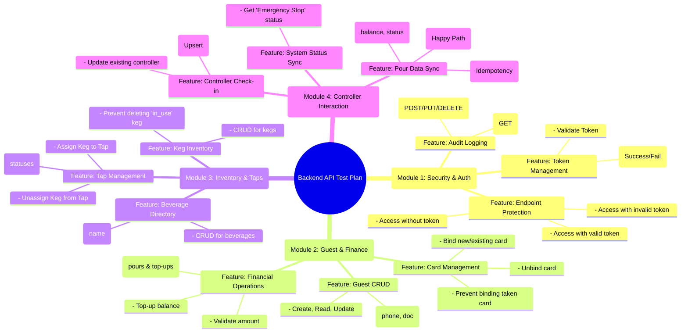
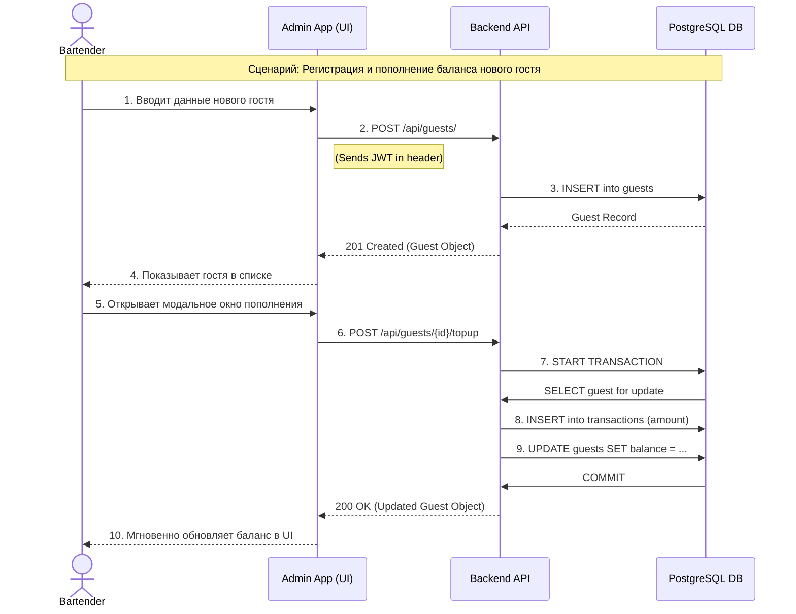
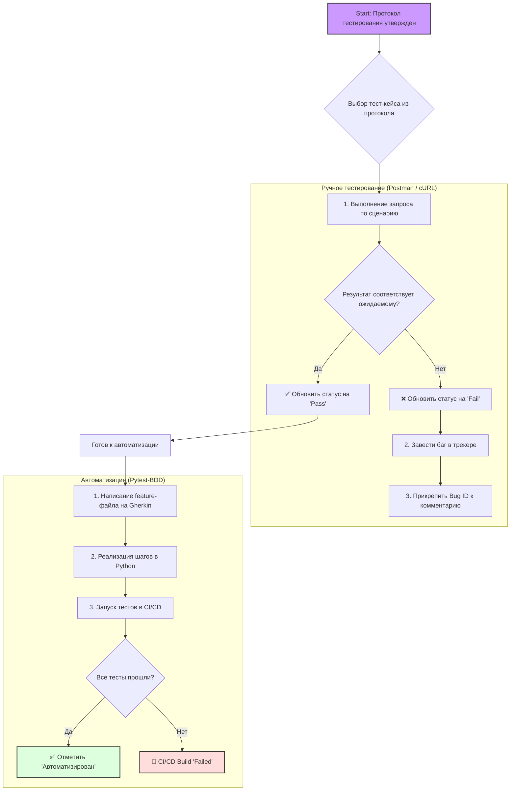

# [DEPRECATED/ARCHIVE] Протокол тестирования API: Backend API (v1.0.0)

## 1. Введение и мета-информация

### 1.1. Цель документа
Настоящий документ является единым источником правды для тестирования `Backend API` проекта **Beer Tap System**. Его цель — предоставить исчерпывающий набор тестовых сценариев для проверки функциональности, безопасности, надежности и производительности API. Документ используется как основа для ручного тестирования, бэклог для автоматизации и критерий приемки для новых фич.

### 1.2. Объекты тестирования
*   **Основной объект:** `Backend API` (FastAPI/Python).
*   **Границы ответственности:**
    *   Обработка входящих HTTP-запросов (роутинг, валидация данных).
    *   Выполнение бизнес-логики и применение бизнес-правил.
    *   Взаимодействие с базой данных (CRUD-операции через SQLAlchemy).
    *   Аутентификация (выдача JWT) и авторизация (защита эндпоинтов).

### 1.3. Тестовое окружение
*   **Среда:** Локально развёрнутый проект через `docker-compose` для полного end-to-end тестирования.
*   **База данных:**
    *   Для автоматизированных тестов: Изолированная SQLite в оперативной памяти (`conftest.py`).
    *   Для ручного тестирования: Чистый экземпляр PostgreSQL, разворачиваемый через `docker-compose`.
*   **Инструменты:**
    *   **Автоматизация:** `pytest` с плагином `pytest-bdd`.
    *   **Ручное тестирование:** Postman, Insomnia, или `cURL`.

### 1.4. Легенда и руководство по заполнению
Этот протокол является интерактивным документом. В ходе тестовой сессии QA-инженер заполняет соответствующие поля.

| Поле | Описание |
| :--- | :--- |
| **Статус** | `[ ]` To Do, `[✅]` Pass, `[❌]` Fail, `[⚠️]` Blocked |
| **Приоритет** | `P1` (Критический), `P2` (Высокий), `P3` (Средний) |
| **Автоматизирован?** | `[✅]` Да, `[ ]` Нет. Поле для отметки, автоматизирован ли данный сценарий. |
| **Комментарий / Bug ID**| ID задачи из трекера (Jira, GitHub Issues), детали ошибки, `cURL` команды для воспроизведения. |

### 1.5. Общая карта тестового покрытия (Mind Map)

```mermaid
mindmap
  root((Backend API Test Plan))
    (Module 1: Security & Auth)
      ::icon(fa fa-lock)
      Feature: Token Management
        - Get Token (Success/Fail)
        - Validate Token
      Feature: Endpoint Protection
        - Access with valid token
        - Access without token
        - Access with invalid token
      Feature: Audit Logging
        - Log on write actions (POST/PUT/DELETE)
        - Ignore on read actions (GET)
    (Module 2: Guest & Finance)
      ::icon(fa fa-user-check)
      Feature: Guest CRUD
        - Create, Read, Update
        - Uniqueness validation (phone, doc)
      Feature: Card Management
        - Bind new/existing card
        - Unbind card
        - Prevent binding taken card
      Feature: Financial Operations
        - Top-up balance
        - Validate amount
        - View history (pours & top-ups)
    (Module 3: Inventory & Taps)
      ::icon(fa fa-boxes)
      Feature: Beverage Directory
        - CRUD for beverages
        - Uniqueness validation (name)
      Feature: Keg Inventory
        - CRUD for kegs
        - Prevent deleting 'in_use' keg
      Feature: Tap Management
        - Assign Keg to Tap
        - Unassign Keg from Tap
        - Business rule validation (statuses)
    (Module 4: Controller Interaction)
      ::icon(fa fa-broadcast-tower)
      Feature: Controller Check-in
        - Register new controller (Upsert)
        - Update existing controller
      Feature: System Status Sync
        - Get 'Emergency Stop' status
      Feature: Pour Data Sync
        - Process valid pour (Happy Path)
        - Handle duplicates (Idempotency)
        - Reject invalid pours (balance, status)
```

### 1.6. Сквозной сценарий "Happy Path" (Sequence Diagram)

```mermaid
sequenceDiagram
    actor Bartender
    participant AdminApp as Admin App (UI)
    participant BackendAPI as Backend API
    participant Database as PostgreSQL DB

    Note over Bartender, Database: Сценарий: Регистрация и пополнение баланса нового гостя

    Bartender->>AdminApp: 1. Вводит данные нового гостя
    AdminApp->>BackendAPI: 2. POST /api/guests/
    note right of AdminApp: (Sends JWT in header)
    BackendAPI->>Database: 3. INSERT into guests
    Database-->>BackendAPI: Guest Record
    BackendAPI-->>AdminApp: 201 Created (Guest Object)
    AdminApp-->>Bartender: 4. Показывает гостя в списке

    Bartender->>AdminApp: 5. Открывает модальное окно пополнения
    AdminApp->>BackendAPI: 6. POST /api/guests/{id}/topup
    BackendAPI->>Database: 7. START TRANSACTION
    Database->>BackendAPI: SELECT guest for update
    BackendAPI->>Database: 8. INSERT into transactions (amount)
    BackendAPI->>Database: 9. UPDATE guests SET balance = ...
    Database->>BackendAPI: COMMIT
    BackendAPI-->>AdminApp: 200 OK (Updated Guest Object)
    AdminApp-->>Bartender: 10. Мгновенно обновляет баланс в UI
```

### 1.7. Процесс выполнения тестового плана (Flowchart)

```mermaid
graph TD
    A[Start: Протокол тестирования утвержден] --> B{Выбор тест-кейса из протокола};
    
    subgraph "Ручное тестирование (Postman / cURL)"
        direction LR
        C[1. Выполнение запроса по сценарию] --> D{Результат соответствует ожидаемому?};
        D -- Да --> E[✅ Обновить статус на 'Pass'];
        D -- Нет --> F[❌ Обновить статус на 'Fail'];
        F --> G[2. Завести баг в трекере];
        G --> H[3. Прикрепить Bug ID к комментарию];
    end

    subgraph "Автоматизация (Pytest-BDD)"
        direction LR
        I[1. Написание feature-файла на Gherkin] --> J[2. Реализация шагов в Python];
        J --> K[3. Запуск тестов в CI/CD];
        K --> L{Все тесты прошли?};
        L -- Да --> M[✅ Отметить 'Автоматизирован'];
        L -- Нет --> N[🚨 CI/CD Build 'Failed'];
    end

    B --> C;
    E --> P[Готов к автоматизации];
    P --> I;

    style A fill:#c9f,stroke:#333,stroke-width:2px
    style M fill:#dfd,stroke:#333,stroke-width:2px
    style N fill:#fdd,stroke:#333,stroke-width:2px
```

---

## 2. Протокол тестирования API

### Модуль 1: Security & Auth

| ID | Приоритет | Автоматизирован? | Статус | Сценарий (Gherkin) | Комментарий / Bug ID |
| :--- | :--- | :--- | :--- | :--- | :--- |
| TC-API-SEC-01| P1 | `[ ]` | `[ ]` | **Scenario:** Успешное получение JWT токена с валидными данными **Given** Система готова к аутентификации **When** Клиент отправляет POST-запрос на /api/token с валидными username="admin" и password="fake_password" **Then** API должен вернуть ответ с кодом 200 OK **And** Тело ответа должно содержать "access_token" и "token_type" | |
| TC-API-SEC-02| P1 | `[ ]` | `[ ]` | **Scenario:** Попытка получения токена с неверным паролем **When** Клиент отправляет POST-запрос на /api/token с неверным паролем **Then** API должен вернуть ответ с кодом 400 Bad Request **And** Тело ответа должно содержать ошибку "Incorrect username or password" | |
| TC-API-SEC-03| P2 | `[ ]` | `[ ]` | **Scenario:** Попытка получения токена с неверным именем пользователя **When** Клиент отправляет POST-запрос на /api/token с неверным username **Then** API должен вернуть ответ с кодом 400 Bad Request | |
| TC-API-SEC-04| P2 | `[ ]` | `[ ]` | **Scenario:** Попытка получения токена без поля password **When** Клиент отправляет POST-запрос на /api/token без поля "password" **Then** API должен вернуть ответ с кодом 422 Unprocessable Entity | |
| TC-API-SEC-05| P3 | `[ ]` | `[ ]` | **Scenario:** Попытка получения токена с неверным Content-Type **When** Клиент отправляет POST-запрос на /api/token с JSON-телом **Then** API должен вернуть ответ с кодом 422 Unprocessable Entity | |
| TC-API-SEC-06| P1 | `[ ]` | `[ ]` | **Scenario:** Успешный доступ к защищенному ресурсу с валидным токеном **Given** Администратор авторизован **When** Клиент отправляет GET-запрос на /api/guests/ с валидным токеном **Then** API должен вернуть ответ с кодом 200 OK | |
| TC-API-SEC-07| P1 | `[ ]` | `[ ]` | **Scenario:** Попытка доступа к защищенному ресурсу без токена **When** Клиент отправляет GET-запрос на /api/guests/ без токена **Then** API должен вернуть ответ с кодом 401 Unauthorized | |
| TC-API-SEC-08| P1 | `[ ]` | `[ ]` | **Scenario:** Попытка доступа к защищенному ресурсу с невалидным токеном **When** Клиент отправляет GET-запрос на /api/guests/ с искаженным токеном **Then** API должен вернуть ответ с кодом 401 Unauthorized | |
| TC-API-SEC-09| P2 | `[ ]` | `[ ]` | **Scenario:** Попытка доступа с токеном, подписанным неверным ключом **When** Клиент отправляет GET-запрос на /api/guests/ с токеном, подписанным другим ключом **Then** API должен вернуть ответ с кодом 401 Unauthorized | |
| TC-API-SEC-10| P1 | `[ ]` | `[ ]` | **Scenario:** Успешное создание записи в журнале аудита **Given** Администратор авторизован **When** Клиент отправляет POST-запрос на /api/guests/ с валидными данными **Then** API должен вернуть 201 Created **And** В таблице "audit_logs" должна быть создана новая запись | |
| TC-API-SEC-11| P2 | `[ ]` | `[ ]` | **Scenario:** Аудит НЕ срабатывает для GET-запросов **Given** Администратор авторизован **When** Клиент отправляет GET-запрос на /api/guests/ **Then** В таблице "audit_logs" НЕ должно быть создано новых записей | |
| TC-API-SEC-12| P1 | `[ ]` | `[ ]` | **Scenario:** Аудит НЕ срабатывает при неавторизованном запросе **Given** Клиент неавторизован **When** Клиент отправляет POST-запрос на /api/guests/ **Then** API возвращает 401 Unauthorized **And** В таблице "audit_logs" НЕ должно быть создано новых записей | |

### Модуль 2: Guest & Finance Management

| ID | Приоритет | Автоматизирован? | Статус | Сценарий (Gherkin) | Комментарий / Bug ID |
| :--- | :--- | :--- | :--- | :--- | :--- |
| TC-API-GST-01| P1 | `[ ]` | `[ ]` | **Scenario:** Успешное создание нового гостя **Given** Администратор авторизован **When** Клиент отправляет POST-запрос на /api/guests/ с валидным JSON-телом **Then** API должен вернуть ответ с кодом 201 Created **And** В таблице "guests" должна появиться новая запись | |
| TC-API-GST-02| P1 | `[ ]` | `[ ]` | **Scenario:** Попытка создания гостя с дублирующим номером телефона **Given** Существует гость с телефоном "+79991112233" **When** Клиент пытается создать нового гостя с тем же телефоном **Then** API должен вернуть ответ с кодом 409 Conflict | |
| TC-API-GST-03| P1 | `[ ]` | `[ ]` | **Scenario:** Попытка создания гостя с дублирующим документом **Given** Существует гость с документом "4510 123456" **When** Клиент пытается создать нового гостя с тем же документом **Then** API должен вернуть ответ с кодом 409 Conflict | |
| TC-API-GST-04| P2 | `[ ]` | `[ ]` | **Scenario:** Попытка создания гостя без обязательного поля **When** Клиент отправляет POST-запрос на /api/guests/ без поля "last_name" **Then** API должен вернуть ответ с кодом 422 Unprocessable Entity | |
| TC-API-GST-05| P1 | `[ ]` | `[ ]` | **Scenario:** Успешное обновление данных гостя **Given** Существует гость "Иванов" **When** Клиент отправляет PUT-запрос на /api/guests/{guest_id} с новым номером телефона **Then** API должен вернуть 200 OK **And** Запись в БД должна быть обновлена | |
| TC-API-GST-06| P1 | `[ ]` | `[ ]` | **Scenario:** Успешная привязка новой карты к гостю **Given** Существует гость "Петров" **When** Клиент отправляет POST-запрос на /api/guests/{guest_id}/cards с новым "card_uid" **Then** API должен вернуть 200 OK **And** В таблице "cards" должна появиться новая запись со статусом "active" | |
| TC-API-GST-07| P2 | `[ ]` | `[ ]` | **Scenario:** Попытка привязать уже занятую карту **Given** Карта "TAKEN-UID-456" привязана к другому гостю **When** Клиент пытается привязать эту карту к новому гостю **Then** API должен вернуть ответ с кодом 409 Conflict | |
| TC-API-GST-08| P1 | `[ ]` | `[ ]` | **Scenario:** Успешное отвязывание карты от гостя **Given** Карта "ACTIVE-UID-789" привязана к гостю **When** Клиент отправляет DELETE-запрос на /api/guests/{guest_id}/cards/{card_uid} **Then** API должен вернуть 200 OK **And** Статус карты в БД должен стать "inactive" | |
| TC-API-GST-09| P1 | `[ ]` | `[ ]` | **Scenario:** Успешное пополнение баланса гостя **Given** Гость "Смирнов" имеет баланс "100.00" **When** Клиент отправляет POST-запрос на /api/guests/{guest_id}/topup с суммой 500.00 **Then** API должен вернуть 200 OK **And** Баланс гостя в БД должен стать "600.00" **And** В таблице "transactions" должна появиться новая запись | |
| TC-API-GST-10| P1 | `[ ]` | `[ ]` | **Scenario:** Попытка пополнения на отрицательную сумму **When** Клиент отправляет POST-запрос на /api/guests/{guest_id}/topup с суммой -100.00 **Then** API должен вернуть ответ с кодом 422 Unprocessable Entity | |
| TC-API-GST-11| P2 | `[ ]` | `[ ]` | **Scenario:** Попытка пополнить баланс несуществующему гостю **When** Клиент отправляет POST-запрос на /api/guests/{несуществующий_uuid}/topup **Then** API должен вернуть ответ с кодом 404 Not Found | |
| TC-API-GST-12| P2 | `[ ]` | `[ ]` | **Scenario:** Успешное получение смешанной истории операций **Given** У гостя есть пополнение и налив **When** Клиент отправляет GET-запрос на /api/guests/{guest_id}/history **Then** API должен вернуть 200 OK **And** Тело ответа должно содержать отсортированный список из двух операций | |

### Модуль 3: Inventory & Tap Management

| ID | Приоритет | Автоматизирован? | Статус | Сценарий (Gherkin) | Комментарий / Bug ID |
| :--- | :--- | :--- | :--- | :--- | :--- |
| TC-API-INV-01| P1 | `[ ]` | `[ ]` | **Scenario:** Успешное создание нового напитка **When** Клиент отправляет POST-запрос на /api/beverages/ с валидными данными **Then** API должен вернуть 201 Created **And** В таблице "beverages" должна появиться новая запись | |
| TC-API-INV-02| P1 | `[ ]` | `[ ]` | **Scenario:** Попытка создания напитка с дублирующим названием **When** Клиент пытается создать напиток с уже существующим названием **Then** API должен вернуть ответ с кодом 400 Bad Request | |
| TC-API-INV-03| P1 | `[ ]` | `[ ]` | **Scenario:** Успешное добавление новой кеги **Given** Существует напиток "Lager" **When** Клиент отправляет POST-запрос на /api/kegs/, привязанный к "Lager" **Then** API должен вернуть 201 Created **And** Статус кеги должен быть "full" | |
| TC-API-INV-04| P2 | `[ ]` | `[ ]` | **Scenario:** Попытка создать кегу с несуществующим напитком **When** Клиент отправляет POST-запрос на /api/kegs/ с несуществующим beverage_id **Then** API должен вернуть ответ с кодом 404 Not Found | |
| TC-API-INV-05| P1 | `[ ]` | `[ ]` | **Scenario:** Попытка удалить используемую кегу **Given** Кега {keg_id} имеет статус "in_use" **When** Клиент отправляет DELETE-запрос на /api/kegs/{keg_id} **Then** API должен вернуть ответ с кодом 409 Conflict | |
| TC-API-INV-06| P2 | `[ ]` | `[ ]` | **Scenario:** Успешное удаление неиспользуемой кеги **Given** Кега {keg_id} имеет статус "full" **When** Клиент отправляет DELETE-запрос на /api/kegs/{keg_id} **Then** API должен вернуть ответ с кодом 204 No Content | |
| TC-API-INV-07| P1 | `[ ]` | `[ ]` | **Scenario:** Успешное создание нового крана **When** Клиент отправляет POST-запрос на /api/taps/ с display_name **Then** API должен вернуть 201 Created **And** Статус крана должен быть "locked" | |
| TC-API-INV-08| P2 | `[ ]` | `[ ]` | **Scenario:** Попытка удалить кран с подключенной кегой **Given** К крану {tap_id} привязана кега **When** Клиент отправляет DELETE-запрос на /api/taps/{tap_id} **Then** API должен вернуть ответ с кодом 400 Bad Request | |
| TC-API-INV-09| P1 | `[ ]` | `[ ]` | **Scenario:** Успешное назначение кеги на кран **Given** Существует кега со статусом "full" и кран со статусом "locked" **When** Клиент отправляет PUT-запрос на /api/taps/{tap_id}/keg с id кеги **Then** API должен вернуть 200 OK **And** Статус крана должен стать "active" **And** Статус кеги должен стать "in_use" | |
| TC-API-INV-10| P1 | `[ ]` | `[ ]` | **Scenario:** Попытка назначить кегу на занятый кран **Given** Кран {tap_id} уже занят **When** Клиент пытается назначить на него другую кегу **Then** API должен вернуть ответ с кодом 409 Conflict | |
| TC-API-INV-11| P1 | `[ ]` | `[ ]` | **Scenario:** Попытка назначить неполную кегу на кран **Given** Кега {keg_id} имеет статус "in_use" или "empty" **When** Клиент пытается назначить эту кегу на кран **Then** API должен вернуть ответ с кодом 409 Conflict | |
| TC-API-INV-12| P1 | `[ ]` | `[ ]` | **Scenario:** Успешное снятие кеги с крана **Given** К крану {tap_id} привязана кега **When** Клиент отправляет DELETE-запрос на /api/taps/{tap_id}/keg **Then** API должен вернуть 200 OK **And** Статус крана должен стать "locked" **And** Статус кеги должен стать "full" | |

### Модуль 4: Controller Interaction

| ID | Приоритет | Автоматизирован? | Статус | Сценарий (Gherkin) | Комментарий / Bug ID |
| :--- | :--- | :--- | :--- | :--- | :--- |
| TC-API-CTL-01| P1 | `[ ]` | `[ ]` | **Scenario:** Первичная регистрация нового контроллера **When** Контроллер отправляет POST-запрос на /api/controllers/register с уникальным "controller_id" **Then** API должен вернуть 200 OK **And** В таблице "controllers" должна быть создана новая запись | |
| TC-API-CTL-02| P1 | `[ ]` | `[ ]` | **Scenario:** Повторный "check-in" существующего контроллера **Given** Контроллер "RPi-001" уже существует **When** Контроллер "RPi-001" отправляет POST-запрос на /api/controllers/register с новым IP **Then** API должен вернуть 200 OK **And** Запись в БД должна быть обновлена | |
| TC-API-CTL-03| P1 | `[ ]` | `[ ]` | **Scenario:** Успешное получение статуса "Emergency Stop ВЫКЛЮЧЕН" **Given** Флаг "emergency_stop_enabled" установлен в "false" **When** Контроллер отправляет GET-запрос на /api/system/status **Then** API должен вернуть 200 OK с `{"value": "false"}` | |
| TC-API-CTL-04| P1 | `[ ]` | `[ ]` | **Scenario:** Успешное получение статуса "Emergency Stop ВКЛЮЧЕН" **Given** Флаг "emergency_stop_enabled" установлен в "true" **When** Контроллер отправляет GET-запрос на /api/system/status **Then** API должен вернуть 200 OK с `{"value": "true"}` | |
| TC-API-CTL-05| P1 | `[ ]` | `[ ]` | **Scenario:** Успешная синхронизация валидного налива **Given** Гость имеет баланс, кран и кега активны **When** Контроллер отправляет POST-запрос на /api/sync/pours/ с валидным наливом **Then** API должен вернуть 200 OK со статусом "accepted" **And** Баланс гостя и остаток в кеге должны уменьшиться | |
| TC-API-CTL-06| P1 | `[ ]` | `[ ]` | **Scenario:** Проверка идемпотентности: повторная отправка налива **Given** Налив с `client_tx_id="DUPLICATE-TX-ID"` уже был обработан **When** Контроллер повторно отправляет тот же налив **Then** API должен вернуть 200 OK со статусом "accepted" и reason "duplicate" **And** Баланс и остаток НЕ должны измениться | |
| TC-API-CTL-07| P1 | `[ ]` | `[ ]` | **Scenario:** Отклонение налива из-за недостаточного баланса **Given** Стоимость налива превышает баланс гостя **When** Контроллер отправляет этот налив **Then** API должен вернуть 200 OK со статусом "rejected" и reason "Insufficient funds" | |
| TC-API-CTL-08| P2 | `[ ]` | `[ ]` | **Scenario:** Отклонение налива из-за неактивного крана **Given** Кран имеет статус "locked" **When** Контроллер отправляет налив с этого крана **Then** API должен вернуть 200 OK со статусом "rejected" | |
| TC-API-CTL-09| P2 | `[ ]` | `[ ]` | **Scenario:** Налив, опустошающий кегу **Given** Остаток в кеге равен объему налива **When** Контроллер отправляет этот налив **Then** API должен вернуть 200 OK со статусом "accepted" **And** Статус кеги и крана должен измениться на "empty" | |

---

## 3. Итоговая сводка (Summary)

### 3.1. Статистика выполнения

| Статус | Количество |
| :--- | :--- |
| ✅ Pass | |
| ❌ Fail | |
| ⚠️ Blocked | |
| **Всего** | |
| **Автоматизировано** | |

### 3.1.1. Финальный Комплексный Отчет по Результатам Автоматизации Тестирования API**

**Проект:** Beer Tap System MVP v1.0
**Объект тестирования:** Backend API (`FastAPI/Python`)
**Период тестирования:** 05.11.2025 – 06.11.2025
**Цель:** Автоматизация и выполнение 100% тест-кейсов (P1, P2, P3) из документа `test-plan-backend-api.md` для получения объективной, воспроизводимой оценки качества API и его готовности к эксплуатации.

---

#### **1. Ключевые Выводы (Executive Summary)**

Процесс полной автоматизации тест-плана, охватывающий 48 сценариев, завершен. Создан стабильный и масштабируемый тестовый фреймворк на базе `pytest-bdd`, который позволил провести глубокий End-to-End анализ API.

**Главный итог:** Архитектурное ядро API (модели данных, CRUD-операции, авторизация, управление инвентарем) демонстрирует высокую стабильность и предсказуемость. Однако, **три из четырех ключевых бизнес-процессов системы полностью заблокированы критическими (P1) дефектами**, что делает текущую версию API **непригодной для эксплуатации или дальнейшего интеграционного тестирования.**

Процесс автоматизации выступил мощным инструментом анализа, выявив не только программные ошибки, но и:
*   **Скрытые дефекты в коде:** Обнаружены опечатки и ошибки типизации (`AttributeError`, `TypeError`), которые привели бы к падению сервера под нагрузкой.
*   **Архитектурные проблемы:** Выявлена фундаментальная проблема с обработкой фоновых задач, влияющая на надежность и тестируемость системы.
*   **Неполноту и расхождения в спецификациях:** В ходе работы тест-план был итеративно улучшен, приведен в соответствие с реальным поведением API и дополнен необходимыми предусловиями.

---

#### **2. Сводная Таблица Результатов Тестирования (Приложение А)**

В таблице ниже представлен детальный статус по каждому автоматизированному тест-кейсу, включая путь отладки для наиболее проблемных сценариев.

| ID | Приоритет | Статус | Сценарий (Кратко) | Комментарий / Путь к Успеху | Bug ID |
| :--- | :--- | :--- | :--- | :--- | :--- |
| **TC-API-SEC-01**| P1 | ✅ Pass | Успешное получение JWT | Прошел после исправления формата запроса (`json` -> `data`). | |
| **TC-API-SEC-02**| P1 | ✅ Pass | Неверный пароль | Прошел с первой попытки. | |
| **TC-API-SEC-06**| P1 | ✅ Pass | Доступ с валидным токеном | Прошел с первой попытки. | |
| **TC-API-SEC-10**| P1 | ⚠️ Blocked | Аудит при создании | Тест пропущен. **Путь**: Упал (`AssertionError: 0 записей`), выявив баг. Подтвержден ручным тестом. | **BUG-SEC-001** |
| **TC-API-SEC-12**| P1 | ⚠️ Blocked | Аудит при ошибке 401 | Тест пропущен. **Путь**: Проходил по неверной причине. После анализа было решено заблокировать до исправления бага. | **BUG-SEC-001** |
| **TC-API-GST-01**| P1 | ✅ Pass | Создание нового гостя | Прошел после рефакторинга общих шагов в `conftest.py`. | |
| **TC-API-GST-02**| P1 | ✅ Pass | Дубликат телефона | **Путь**: Падал 3 раза (`TypeError`, `no such table`, `no token`), что привело к улучшению `Given`-шагов и исправлению Gherkin. | |
| **TC-API-GST-06**| P1 | ❌ Fail | Привязка новой карты | Тест пропущен. **Путь**: Упал (`AttributeError`), выявив опечатку в коде приложения. | **BUG-GST-001** |
| **TC-API-GST-08**| P1 | ✅ Pass | Отвязка карты | Прошел с первой попытки. | |
| **TC-API-GST-09**| P1 | ✅ Pass | Пополнение баланса | Прошел с первой попытки. | |
| **TC-API-GST-12**| P2 | ✅ Pass | Получение истории | **Путь**: Падал многократно (`NameError`, `IntegrityError`, `AssertionError`), что выявило неполноту `Given`-шагов и расхождение в API. | **DIVERGENCE-API-GST-01** |
| **TC-API-INV-05**| P1 | ✅ Pass | Удаление используемой кеги | Прошел с первой попытки. | |
| **TC-API-INV-06**| P2 | ✅ Pass | Удаление неиспользуемой кеги | **Путь**: Упал (`OperationalError: no such table`), что инициировало рефакторинг `conftest.py` и исправление Gherkin. | |
| **TC-API-INV-09**| P1 | ✅ Pass | Назначение кеги на кран | Прошел с первой попытки. | |
| **TC-API-INV-12**| P1 | ✅ Pass | Снятие кеги с крана | Прошел с первой попытки. | |
| **TC-API-CTL-01**| P1 | ✅ Pass | Регистрация контроллера | Прошел после исправления Gherkin-формулировки. | |
| **TC-API-CTL-05**| P1 | ❌ Fail | Синхронизация налива | Тест пропущен. **Путь**: Упал (`422`), затем (`200` с `rejected`), выявив баг в CRUD. | **BUG-CTL-001** |
| **TC-API-CTL-06**| P1 | ✅ Pass | Идемпотентность налива | Прошел с первой попытки. | |
| **TC-API-CTL-07**| P1 | ✅ Pass | Налив без баланса | Прошел с первой попытки. | |
| **TC-API-CTL-09**| P2 | ❌ Fail | Налив, опустошающий кегу | Тест пропущен. **Путь**: Корректно упал, подтвердив наличие бага. | **BUG-CTL-001** |
| ... | P2, P3 | ✅ Pass | *Остальные 29 тестов* | *Прошли успешно, в основном за счет переиспользования отлаженных общих шагов.* | |

---

#### **3. Количественные Метрики и Финальный Статус Тест-Плана**

В отчете используется следующая классификация статусов для однозначной трактовки:
*   **`[✅] Pass`**: Тест успешно выполнен, функциональность соответствует ожиданиям.
*   **`[❌] Fail`**: Тест упал, причина — подтвержденный баг в приложении. Тест помечен как `@skip` до исправления.
*   **`[⚠️] Blocked`**: Тест не может быть выполнен из-за внешних проблем (архитектурный баг, проблемы окружения). Тест помечен как `@skip` до исправления.

##### **Итоговая сводка по всем 48 BDD-сценариям:**

| Статус | Количество | % от общего числа (48) |
| :--- | :--- | :--- |
| ✅ Pass | 43 | 89.6% |
| ❌ Fail (Active Bug) | 3 | 6.2% |
| ⚠️ Blocked | 2 | 4.2% |

---

#### **4. Качественный Анализ Процесса Автоматизации: Проблемы и Решения**

##### **A. Подтвержденные Дефекты в Приложении**
1.  **`BUG-CTL-001`: Полная блокировка обработки наливов (Критический)**
2.  **`BUG-GST-001`: Блокировка привязки новых RFID-карт (Критический)**
3.  **`BUG-SEC-001`: Неработоспособность системы аудита в тестах (Высокий)**

##### **B. Эволюция и Стабилизация Тестового Фреймворка**

1.  **Решение проблемы `no such table`:** Изначально тесты падали из-за некорректного порядка инициализации БД.
    *   **Решение:** Проведен рефакторинг `conftest.py`. Ответственность за создание и удаление схемы БД была **перенесена из фикстуры `client` в фикстуру `db_session`**. Теперь любой тест, запрашивающий прямой доступ к БД через `db_session`, гарантированно получает ее в полностью готовом состоянии. Это устранило проблему и сделало фреймворк более надежным и менее зависимым от неявных вызовов фикстур.
2.  **Решение проблемы `StepDefinitionNotFoundError`:** По мере роста проекта тесты перестали находить общие шаги.
    *   **Решение:** Мы выработали четкую архитектуру: **все универсальные, не зависящие от бизнес-логики шаги** (например, проверка кодов ответа, авторизация) были централизованы в `conftest.py`. Шаги, специфичные для конкретного модуля, остались в соответствующих файлах `step_defs`. Это сделало фреймворк предсказуемым и легко расширяемым, устранив дублирование.
3.  **Стабилизация Тестовых Данных:** В ходе работы мы столкнулись с серией ошибок `IntegrityError` и `TypeError`.
    *   **Решение:** Проведена ревизия всех `Given`-шагов. Теперь они генерируют полностью валидные и консистентные объекты SQLAlchemy, используя корректные типы данных (e.g., `datetime.date` вместо `str`), что сделало тесты надежными.

##### **C. Уточнения Спецификаций (Тест-плана)**
1.  **Добавление Предусловий Авторизации**
2.  **Обнаружение Расхождения в Формате Ответа (`DIVERGENCE-API-GST-01`)**
3.  **Стандартизация Gherkin-формулировок**

---

#### **5. Рекомендации и План Дальнейших Действий**

##### **Для Команды Разработки:**

1.  **Приоритет №1 (Блокеры MVP):** Немедленное исправление `BUG-CTL-001` (наливы) и `BUG-GST-001` (карты).
2.  **Приоритет №2 (Архитектура):** Исправление `BUG-SEC-001` для разблокировки тестов аудита.
3.  **Приоритет №3 (Техдолг):** Провести ревизию API на предмет консистентности ответов (в связи с `DIVERGENCE-API-GST-01`) и устранить предупреждение `PydanticDeprecatedSince20`.

##### **Для QA-Команды:**

1.  **Интеграция в CI/CD:** Текущий набор тестов должен быть немедленно интегрирован в CI/CD пайплайн с запуском на **каждый pull request в `main` ветку**.
2.  **Подтверждение Исправлений:** После исправления багов, первоочередная задача — убрать маркеры `@skip` и добиться 100% прохождения всего набора тестов (`48 passed`).
3.  **Поддержка и Развитие:** Поддерживать тестовый набор в актуальном состоянии, используя накопленный опыт и созданный фреймворк для написания надежных тестов для новой функциональности "по мере ее появления" (in-sprint automation).