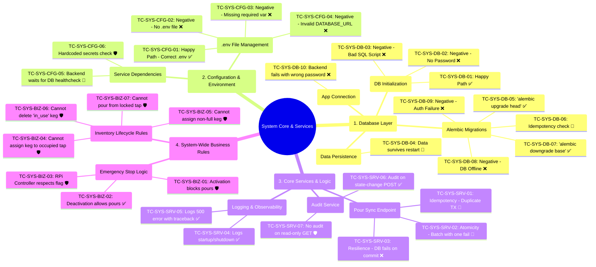

# Протокол системного тестирования: System Core & Services (v1.0.0)

## 1. Введение и мета-информация

### 1.1. Цель документа
Настоящий документ является официальным протоколом для проведения системного тестирования объекта `System Core & Services` проекта **Beer Tap System**. Его основная цель — верификация **нефункциональных** и **системных** аспектов программного комплекса. Тестирование направлено на проверку стабильности, предсказуемости развертывания, корректности конфигурации, целостности данных и реакции системы на нештатные ситуации.

### 1.2. Объекты тестирования
Объектом тестирования является `System Core & Services` — ядро системы, не имеющее прямого пользовательского интерфейса, но обеспечивающее фундаментальную работоспособность всего продукта. В его границы ответственности входят:
*   **Слой базы данных (PostgreSQL):** Инициализация, миграции, сохранность данных.
*   **Конфигурация и окружение (Docker, .env):** Запуск сервисов, передача переменных окружения, взаимодействие контейнеров.
*   **Ключевые сервисы и логика:** Механизмы транзакционной целостности, логирования и аудита.
*   **Общесистемные бизнес-правила:** Логика, затрагивающая несколько модулей (например, Emergency Stop).

### 1.3. Предусловия и тестовое окружение
Для проведения тестирования по данному протоколу необходимо следующее:
*   **Среда:** Локальная машина с установленными и работающими `Docker` и `Docker Compose`.
*   **Исходный код:** Полностью клонированный репозиторий проекта `Beer Tap System`.
*   **Инструменты:**
    *   Доступ к командной строке (`bash`, `sh` или аналоги).
    *   Клиент для подключения к PostgreSQL внутри контейнера (например, `psql`).
    *   Текстовый редактор для модификации конфигурационных файлов.

### 1.4. Легенда и руководство по заполнению
Каждый тест-кейс в данном протоколе должен быть отмечен одним из статусов.

| Статус | Описание |
| :--- | :--- |
| `[x]` | **Pass:** Тест пройден, фактический результат полностью соответствует ожидаемому. |
| `[!]` | **Fail:** Тест провален, фактический результат не соответствует ожидаемому. |
| `[-]` | **Blocked:** Тест не может быть выполнен из-за внешней проблемы или зависимости от другого проваленного теста. |
| `[ ]` | **To Do:** Тест еще не выполнялся. |

| Приоритет | Описание |
| :--- | :--- |
| **P1** | **Критический:** Тест проверяет основную функциональность, без которой система не может работать. |
| **P2** | **Высокий:** Тест проверяет важную функциональность или ключевые негативные сценарии. |
| **P3** | **Средний:** Тест проверяет второстепенную функциональность или граничные случаи. |

Отличная идея. Визуализация — мощный инструмент для обзора и коммуникации.

Как QA Lead, я понимаю, что хороший план тестирования должен быть не только подробным, но и наглядным. Я подготовил Mind Map (интеллект-карту), которая визуализирует всю иерархию системных тестов, от модулей до конкретных сценариев.

Эта карта идеально подходит для вставки в `README.md` на GitHub или для работы в `mermaidchart.com`. Она дает "вид с высоты птичьего полета" на все покрытие, сохраняя при этом ссылки на детальные тест-кейсы (через их ID).

---

### 1.5. **Визуализация протокола тестирования: `System Core & Services`**

Это визуальное представление полного плана тестирования, сгруппированное по модулям и функциональным областям. Каждый конечный узел представляет собой конкретный тест-кейс из детального протокола.

**Легенда иконок:**
*   ✅ **Happy Path:** Проверка успешного выполнения основной функции.
*   ❌ **Negative Path:** Проверка реакции системы на ошибку или некорректные данные.
*   🔄 **Idempotency/State:** Проверка сохранения состояния или идемпотентности операции.
*   🛡️ **Security/Rules:** Проверка соблюдения правил безопасности или бизнес-логики.

---

## 2. Протокол системного тестирования

### Модуль 1: Database Layer

| ID | Приоритет | Статус | Сценарий (Gherkin) | Комментарий / Bug ID |
| :--- | :--- | :--- | :--- | :--- |
| TC-SYS-DB-01 | P1 | `[ ]` | **Scenario:** Позитивный сценарий: Успешный запуск и инициализация БД **Given** В корне проекта присутствует корректно заполненный файл `.env` **And** В `docker-compose.yml` указан volume `docs/postgres_schema.sql:/docker-entrypoint-initdb.d/init.sql` **When** Пользователь выполняет `docker-compose up -d --build` **Then** Сервис "postgres" должен успешно запуститься и оставаться в состоянии "running" **And** В логах сервиса "postgres" должна присутствовать строка "database system is ready to accept connections" **And** Команда `docker-compose exec postgres psql -U $POSTGRES_USER -d $POSTGRES_DB -c "\dt"` должна показать список созданных таблиц. | |
| TC-SYS-DB-02 | P1 | `[ ]` | **Scenario:** Негативный сценарий: Запуск без переменной POSTGRES_PASSWORD **Given** В файле `.env` отсутствует или закомментирована переменная `POSTGRES_PASSWORD` **When** Пользователь выполняет `docker-compose up -d` **Then** Сервис "postgres" должен упасть или постоянно перезапускаться **And** В логах сервиса "postgres" должна появиться ошибка "password authentication failed". | |
| TC-SYS-DB-03 | P2 | `[ ]` | **Scenario:** Негативный сценарий: Ошибка в скрипте инициализации **Given** Файл `docs/postgres_schema.sql` изменен и содержит синтаксическую ошибку SQL **When** Пользователь выполняет `docker-compose up -d --build` **Then** Сервис "postgres" должен упасть или постоянно перезапускаться **And** В логах сервиса "postgres" должна появиться ошибка выполнения `init.sql`. | |
| TC-SYS-DB-04 | P1 | `[ ]` | **Scenario:** Сохранность данных (Data Persistence) после перезапуска **Given** Сервисы запущены и в таблицу `guests` добавлена тестовая запись **When** Пользователь выполняет `docker-compose down` и затем `docker-compose up -d` **Then** Сервис "postgres" должен успешно запуститься **And** При проверке через psql тестовая запись в таблице `guests` должна существовать. | |
| TC-SYS-DB-05 | P1 | `[ ]` | **Scenario:** Позитивный сценарий: Первичное применение миграций (Alembic) **Given** Сервис "postgres" запущен с чистой схемой **When** Пользователь выполняет `docker-compose exec beer_backend_api alembic upgrade head` **Then** Команда должна завершиться успешно **And** В БД должна появиться таблица `alembic_version` с записью о последней миграции. | |
| TC-SYS-DB-06 | P2 | `[ ]` | **Scenario:** Проверка идемпотентности миграций (Alembic) **Given** База данных уже обновлена до последней версии **When** Пользователь повторно выполняет `docker-compose exec beer_backend_api alembic upgrade head` **Then** Команда должна завершиться успешно, без сообщений о применении новых миграций. | |
| TC-SYS-DB-07 | P2 | `[ ]` | **Scenario:** Позитивный сценарий: Откат всех миграций (Alembic) **Given** База данных обновлена до последней версии **When** Пользователь выполняет `docker-compose exec beer_backend_api alembic downgrade base` **Then** Команда должна завершиться успешно **And** В таблице `alembic_version` не должно быть записей. | |
| TC-SYS-DB-08 | P1 | `[ ]` | **Scenario:** Негативный сценарий: Попытка миграции при остановленной БД **Given** Сервис "postgres" остановлен **When** Пользователь выполняет `docker-compose exec beer_backend_api alembic upgrade head` **Then** Команда должна завершиться с ошибкой подключения (e.g., "Connection refused"). | |
| TC-SYS-DB-09 | P1 | `[ ]` | **Scenario:** Негативный сценарий: Попытка миграции с неверными учетными данными **Given** Сервис "postgres" запущен, но в `.env` указан неверный `POSTGRES_PASSWORD` и сервис `beer_backend_api` перезапущен **When** Пользователь выполняет `docker-compose exec beer_backend_api alembic upgrade head` **Then** Команда должна завершиться с ошибкой аутентификации. | |

### Модуль 2: Configuration & Environment

| ID | Приоритет | Статус | Сценарий (Gherkin) | Комментарий / Bug ID |
| :--- | :--- | :--- | :--- | :--- |
| TC-SYS-CFG-01 | P1 | `[ ]` | **Scenario:** Позитивный сценарий: Запуск с корректным .env файлом **Given** В корне проекта присутствует файл `.env` со всеми необходимыми переменными **When** Пользователь выполняет `docker-compose up -d` **Then** Сервисы "postgres" и "beer_backend_api" должны успешно запуститься **And** API по `http://localhost:8000/` должен возвращать 200 OK. | |
| TC-SYS-CFG-02 | P1 | `[ ]` | **Scenario:** Негативный сценарий: Запуск без .env файла **Given** В корне проекта отсутствует файл `.env` **When** Пользователь выполняет `docker-compose up -d` **Then** `docker-compose` должен вывести предупреждения о пустых переменных **And** Сервисы "postgres" и "beer_backend_api" должны упасть или постоянно перезапускаться. | |
| TC-SYS-CFG-03 | P1 | `[ ]` | **Scenario:** Негативный сценарий: Отсутствие обязательной переменной (POSTGRES_DB) **Given** В файле `.env` отсутствует переменная `POSTGRES_DB` **When** Пользователь выполняет `docker-compose up -d` **Then** Сервис "postgres" должен упасть с ошибкой отсутствия имени БД. | |
| TC-SYS-CFG-04 | P2 | `[ ]` | **Scenario:** Негативный сценарий: Некорректное значение DATABASE_URL **Given** В `.env` переменная `DATABASE_URL` содержит неверный хост **When** Пользователь выполняет `docker-compose up -d` **Then** Сервис "postgres" должен запуститься, а "beer_backend_api" - упасть **And** В логах "beer_backend_api" должна быть ошибка подключения к неверному хосту. | |
| TC-SYS-CFG-05 | P1 | `[ ]` | **Scenario:** Проверка зависимости бэкенда от healthcheck базы данных **Given** В `docker-compose.yml` сервис "beer_backend_api" зависит от `service_healthy` сервиса "postgres" **When** Пользователь выполняет `docker-compose up -d` **Then** Запуск "beer_backend_api" не начнется, пока "postgres" не станет "healthy" **And** В логах "beer_backend_api" не должно быть ошибок подключения при старте. | |

### Модуль 3: Core Services & Logic

| ID | Приоритет | Статус | Сценарий (Gherkin) | Комментарий / Bug ID |
| :--- | :--- | :--- | :--- | :--- |
| TC-SYS-SRV-01 | P1 | `[ ]` | **Scenario:** Идемпотентность: Повторная отправка одного и того же налива **Given** Сформирован валидный `PourData` с уникальным `client_tx_id` **When** Отправляется первый POST-запрос на `/api/sync/pours/` **Then** Сервер возвращает 200 OK со статусом "accepted" **And** Когда отправляется точно такой же повторный запрос **Then** Сервер возвращает 200 OK со статусом "accepted" и причиной "duplicate" **And** В таблице `pours` создана только одна запись. | |
| TC-SYS-SRV-02 | P1 | `[ ]` | **Scenario:** Атомарность: Обработка пакета с одним невалидным наливом **Given** Сформирован пакет из двух наливов: один валидный, другой - с недостатком средств у гостя **When** Пакет отправляется на `/api/sync/pours/` **Then** Сервер возвращает 200 OK **And** В ответе статус для валидного налива - "accepted", для невалидного - "rejected" **And** В БД сохранена только валидная транзакция. | |
| TC-SYS-SRV-03 | P2 | `[ ]` | **Scenario:** Отказоустойчивость: Сбой БД во время коммита пакета **Given** Сформирован валидный пакет наливов **When** Запрос отправляется на `/api/sync/pours/` и симулируется сбой `db.commit()` **Then** API должен вернуть ошибку 500 Internal Server Error **And** В логах должна быть ошибка "Failed to commit pours batch" **And** В таблице `pours` не должно появиться ни одной новой записи из пакета. | |
| TC-SYS-SRV-04 | P1 | `[ ]` | **Scenario:** Создание записи в журнале аудита для state-changing операции **Given** Пользователь аутентифицирован **When** Пользователь выполняет успешный POST-запрос на создание гостя **Then** Запрос завершается успешно **And** Сразу после этого в таблице `audit_logs` появляется новая запись с `actor_id` и `action`. | |
| TC-SYS-SRV-05 | P2 | `[ ]` | **Scenario:** Запись в журнале аудита НЕ создается для read-only операции **Given** Пользователь аутентифицирован **When** Пользователь выполняет GET-запрос на получение списка гостей **Then** Запрос завершается успешно **And** В таблице `audit_logs` не должно появляться новых записей. | |

### Модуль 4: System-Wide Business Rules

| ID | Приоритет | Статус | Сценарий (Gherkin) | Комментарий / Bug ID |
| :--- | :--- | :--- | :--- | :--- |
| TC-SYS-BIZ-01 | P1 | `[ ]` | **Scenario:** Активация Emergency Stop должна блокировать новые наливы **Given** Флаг "emergency_stop_enabled" = 'false' **When** Администратор устанавливает флаг в 'true' через API `/api/system/emergency_stop` **Then** Последующий запрос на `/api/sync/pours/` должен быть отклонен сервером **And** Статус налива в ответе должен быть "rejected". | |
| TC-SYS-BIZ-02 | P1 | `[ ]` | **Scenario:** Деактивация Emergency Stop должна разрешать новые наливы **Given** Флаг "emergency_stop_enabled" = 'true' **When** Администратор устанавливает флаг в 'false' через API **Then** Последующий запрос на `/api/sync/pours/` должен быть успешно обработан **And** Статус налива в ответе должен быть "accepted". | |
| TC-SYS-BIZ-03 | P2 | `[ ]` | **Scenario:** Невозможно назначить кегу на уже занятый кран **Given** Кран №1 уже имеет назначенную кегу **When** Пользователь пытается назначить другую кегу на кран №1 через `PUT /api/taps/1/keg` **Then** API должен вернуть ошибку 409 Conflict **And** Назначенная на кран кега не должна измениться. | |
| TC-SYS-BIZ-04 | P2 | `[ ]` | **Scenario:** Невозможно назначить неполную кегу на кран **Given** Кран №1 свободен, а кега №2 имеет статус "in_use" или "empty" **When** Пользователь пытается назначить кегу №2 на кран №1 **Then** API должен вернуть ошибку 409 Conflict. | |
| TC-SYS-BIZ-05 | P1 | `[ ]` | **Scenario:** Невозможно удалить кегу, которая используется **Given** Кега №1 назначена на кран и имеет статус "in_use" **When** Пользователь пытается удалить кегу через `DELETE /api/kegs/<ID_кеги_1>` **Then** API должен вернуть ошибку 409 Conflict **And** Запись о кеге должна остаться в БД. | |
| TC-SYS-BIZ-06 | P2 | `[ ]` | **Scenario:** Невозможно совершить налив из заблокированного крана **Given** Кран №2 имеет статус "locked" **When** На сервер приходит запрос на синхронизацию налива с крана №2 **Then** Сервер должен отклонить транзакцию со статусом "rejected" и причиной "Tap is not in 'active' state". | |

---

## 3. Итоговая сводка (Summary)

### 3.1. Статистика выполнения
| Всего тестов | Пройдено (Pass) | Провалено (Fail) | Заблокировано (Blocked) | Не выполнялось (To Do) |
| :--- | :--- | :--- | :--- | :--- |
| 27 | | | | |

### 3.2. Ключевые выводы и риски
*(Заполняется после проведения тестирования)*

### 3.3. Итоговый вердикт
*(Заполняется после проведения тестирования)*

**Решение:** `[ ]` Релиз-кандидат `v1.0.0` **ГОТОВ** к развертыванию.
**Решение:** `[ ]` Релиз-кандидат `v1.0.0` **НЕ ГОТОВ** к развертыванию из-за наличия критических дефектов.