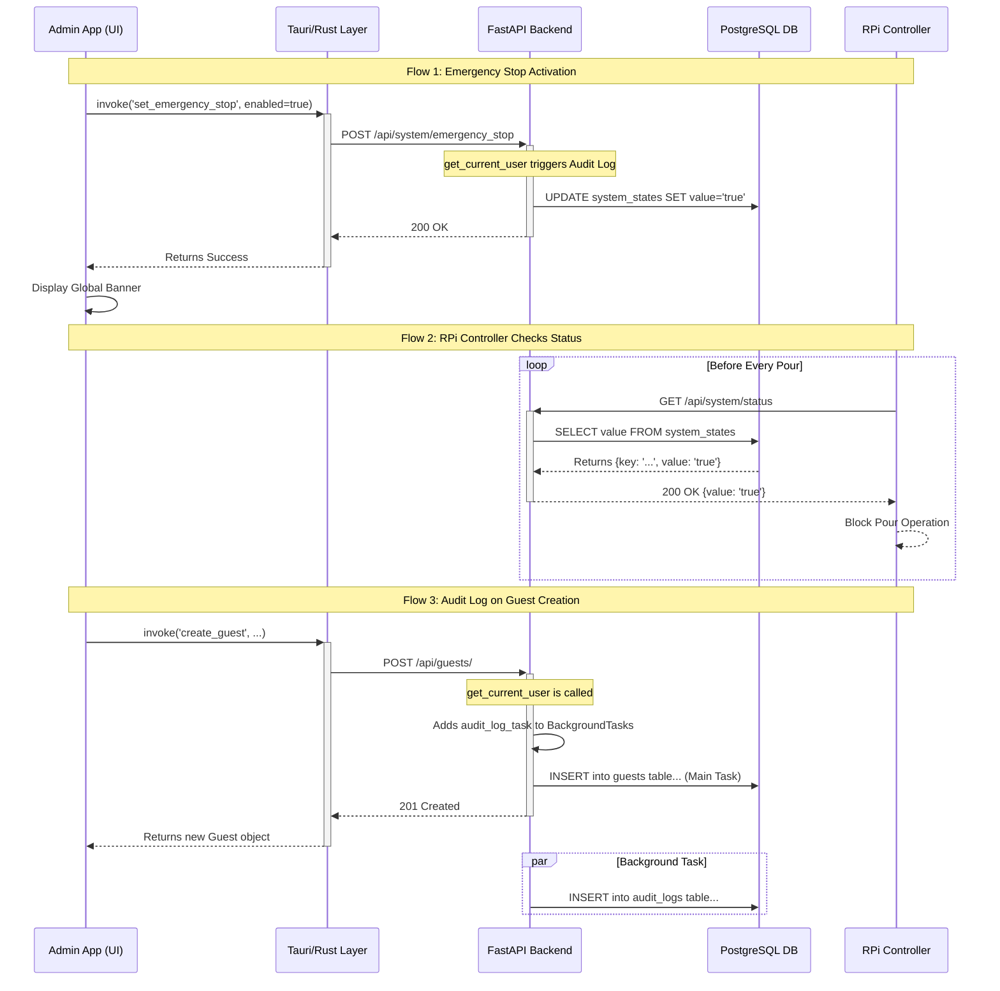

# Executive Summary: Phase 4.1 Completion

**Phase 4.1 of the Beer Tap System project is successfully complete.** This critical phase focused on implementing foundational security and control features, resulting in the delivery of two key functions: **Emergency Stop** and a system-wide **Audit Log**.

The **Emergency Stop** feature provides staff with a "master switch" within the Admin App to instantly disable all beer taps across the venue. This capability is crucial for responding to operational issues, safety concerns, or preventing financial losses. The implementation spans the user interface, backend server, and RPi controllers, ensuring a robust and reliable system-wide lockdown.

The **Audit Log** function introduces a non-intrusive, automatic mechanism that records all significant actions performed by users within the system (e.g., creating guests, topping up balances, managing equipment). This creates an essential layer of accountability and traceability, vital for security, dispute resolution, and future operational analysis.

Completion of this phase transforms the Admin App from a simple management tool into a genuine operational control center. The system is now significantly more secure, resilient, and prepared for comprehensive end-to-end testing before its initial pilot deployment.

---
### **Артефакт 2/6: `docs/diagrams/phase-4.1-architecture.mermaid`**


---
### **Артефакт 3/6: `docs/phase-4.1-summary.md`**

# Feature Reference & Implementation Summary — Phase 4.1: Critical Functions (Emergency Stop & Audit Log)
*   **Version:** 1.0.0
*   **Дата завершения:** 2025-10-30
*   **Автор(ы):** AI Assistant (на основе совместной работы с Gleb Kovalerenko)
*   **Источники:**
    *   **Репозиторий:** `glebkovalerenko-ui/beer-tap-system`
    *   **История чата:** Вся переписка по реализации Фазы 4.1.

## 1. Цель и контекст фазы

Фаза 4.1 была направлена на укрепление фундамента системы **Beer Tap System** путем внедрения двух критически важных функций, отсутствовавших в MVP: **Emergency Stop** и **Audit Log**.

*   **Emergency Stop** предоставляет операторам немедленный и полный контроль над физическим оборудованием, позволяя мгновенно остановить все операции налива в случае нештатных ситуаций. Это ключевая функция для обеспечения безопасности, предотвращения потерь и оперативного управления.
*   **Audit Log** создает автоматический, неизменяемый журнал всех значимых действий пользователей. Это обеспечивает полную подотчетность, упрощает расследование инцидентов и является основой для будущих систем анализа и безопасности.

Реализация этих функций вывела проект на новый уровень зрелости, превратив его из простого инструмента учёта в полноценный, контролируемый и безопасный операционный комплекс.

## 2. Реализованные функции (по шагам)

### 🔴 4.1.1 Emergency Stop

**Назначение:** Моментальная блокировка и разблокировка всех операций налива в системе.

**Компоненты и взаимодействие:**

*   **Backend (FastAPI):**
    *   **Эндпоинт `POST /api/system/emergency_stop`:** Принимает `{"value": "true"}` или `{"value": "false"}` для установки глобального флага. Эндпоинт защищён JWT-аутентификацией.
    *   **Эндпоинт `GET /api/system/status`:** Публичный эндпоинт, возвращающий текущее состояние флага (`{"key": "emergency_stop_enabled", "value": "..."}`). Оптимизирован для частого опроса контроллерами.
    *   **Хранилище:** Глобальный флаг хранится в таблице `system_states` в PostgreSQL. Это обеспечивает персистентность состояния между перезапусками сервера.
    *   **Логирование:** Активация и деактивация режима ЧС автоматически записываются в **Audit Log**.

*   **RPi Controller:**
    *   **Интеграция:** Перед каждой эмуляцией налива (после успешного считывания UID карты) контроллер вызывает функцию `check_emergency_stop()`.
    *   **Логика:** Эта функция отправляет запрос на `GET /api/system/status`.
    *   **Отказоустойчивость:** Если `emergency_stop == true` ИЛИ происходит **любая сетевая ошибка** (таймаут, недоступность сервера), функция возвращает `True`, и операция налива немедленно блокируется. Это fail-safe механизм, prioritizing safety.

*   **Frontend (Admin App):**
    *   **UI:** На странице "Dashboard" добавлена заметная кнопка "Activate/Deactivate Emergency Stop", цвет и текст которой меняются в зависимости от текущего состояния. Для предотвращения случайных нажатий реализовано модальное окно с подтверждением.
    *   **Состояние:** Создан новый Svelte Store `systemStore.js`, который реализует механизм **Polling**. Он каждые 10 секунд опрашивает `GET /api/system/status` для получения актуального состояния флага.
    *   **Визуализация:** В корневом компоненте `App.svelte` добавлен глобальный, неотключаемый баннер, который появляется на всех страницах, если система находится в режиме экстренной остановки.

### 📜 4.1.2 Audit Log

**Назначение:** Автоматическая запись всех действий пользователей, изменяющих состояние системы.

**Компоненты и реализация:**

*   **Backend (DB):**
    *   Используется существующая таблица `audit_logs` с полями `log_id`, `timestamp`, `actor_id`, `action`.

*   **Архитектура логирования (FastAPI):**
    *   **Механизм:** Реализован с помощью **FastAPI Dependencies** и **Background Tasks**. Логика аудита инкапсулирована внутри зависимости `get_current_user` (`security.py`).
    *   **Процесс:** Для каждого защищенного запроса (`POST`, `PUT`, `DELETE`) `get_current_user` добавляет в фоновую очередь задачу на создание записи в логе.
    *   **Надежность:** Для решения проблемы с жизненным циклом сессий БД, фоновая задача создает свою собственную, независимую сессию `SessionLocal()`, выполняет запись, делает `commit` и закрывает сессию. Это гарантирует атомарность и предотвращает конфликты с основной транзакцией запроса.
    *   **Наблюдаемость:** Для отладки фоновых задач все отладочные сообщения `print()` были заменены на стандартный модуль `logging`, а в `main.py` добавлена централизованная конфигурация `logging.basicConfig`.

*   **Frontend:**
    *   На данном этапе UI для просмотра лога не реализовывался.
    *   **Валидация:** Корректность работы механизма была подтверждена путем выполнения тестовых API-запросов и последующей прямой проверки содержимого таблицы `audit_logs` в базе данных.

## 3. Отклонения и улучшения от исходного плана

В ходе реализации были сделаны значительные улучшения, повысившие качество и надежность системы.

1.  **Архитектура аудита:** Первоначальная реализация с `BackgroundTasks` не работала из-за проблем с жизненным циклом сессии SQLAlchemy. Проблема была диагностирована путем временного перехода на синхронную запись, а затем решена финальной, более надежной архитектурой с созданием новой сессии для каждой фоновой задачи.
2.  **Наблюдаемость (Logging):** Проблема с "молчанием" фоновых задач в логах была решена путем полного перехода с `print()` на стандартный модуль `logging` и его централизованной конфигурации в `main.py`. Это является лучшей практикой для production-приложений.
3.  **Отказоустойчивость контроллера:** Логика проверки "Emergency Stop" на RPi была сделана fail-safe: любая ошибка сети трактуется как сигнал к блокировке, что является наиболее безопасным поведением.
4.  **UX "Emergency Stop":** Кнопка на UI была дополнена модальным окном подтверждения для защиты от случайных нажатий.
5.  **Отладка сборки Admin App:** В ходе работ была решена комплексная проблема со сборкой Tauri-приложения, связанная с несоответствием версий пакетов и устаревшим `tauri-cli`. Этот опыт важен для будущей поддержки проекта.
6.  **Архитектурное решение (на будущее):** Было отмечено, что механизм Polling является временным решением. Для будущей real-time коммуникации с контроллерами предпочтительной технологией выбран **WebSocket** из-за необходимости двунаправленной связи.

## 4. Критерии готовности (Definition of Done)

*   [✅] Функция "Emergency Stop" корректно блокирует новые наливы на RPi-контроллере.
*   [✅] Admin App корректно отображает статус "Emergency Stop" и позволяет им управлять.
*   [✅] "Audit Log" автоматически фиксирует все `POST`, `PUT`, `DELETE` запросы к защищенным эндпоинтам.
*   [✅] Запись в лог аудита происходит в фоновом режиме и не замедляет API.
*   [✅] Все изменения протестированы сквозным сценарием (UI → API → DB / RPi → API).

## 5. Следующие шаги

*   Приступить к **Фазе 4.2: Комплексное E2E тестирование**, чтобы проверить все реализованные функции в единой связке.
*   Создать UI для просмотра `AuditLog` (задача добавлена в `issues.csv`).
*   Реализовать более надежный механизм оповещения контроллеров (WebSocket) вместо Polling (задача добавлена в `issues.csv`).

---
### **Артефакт 4/6: `docs/api_coverage_phase4.1.md`**

# API Coverage Report — Phase 4.1

В рамках Фазы 4.1 были доработаны и реализованы следующие API-эндпоинты, связанные с управлением системой и аудитом.

| Эндпоинт | Метод | Авторизация | Описание | Пример Request Body | Пример Response |
|---|---|---|---|---|---|
| `/api/system/status` | `GET` | Нет | Возвращает текущее состояние флага экстренной остановки. Предназначен для частого опроса контроллерами. | N/A | `{"key": "emergency_stop_enabled", "value": "false"}` |
| `/api/system/emergency_stop`| `POST` | JWT Bearer | Устанавливает новое состояние для флага экстренной остановки. Активирует запись в `AuditLog`. | `{"value": "true"}` | `{"key": "emergency_stop_enabled", "value": "true"}` |
| (Любой защищенный эндпоинт) | `POST`, `PUT`, `DELETE` | JWT Bearer | (Неявная функциональность) Вызов любого из этих эндпоинтов инициирует фоновую задачу по созданию записи в `AuditLog`. | N/A | N/A |

---
### **Артефакт 5/6: `docs/file_changes_phase4.1.md`**

# File-Level Change Summary — Phase 4.1

| Файл | Слой | Статус | Описание изменений |
|---|---|---|---|
| `backend/main.py` | Backend | Изменен | Добавлена централизованная конфигурация `logging.basicConfig`. |
| `backend/api/system.py` | Backend | Изменен | Реализованы эндпоинты `GET /status` и `POST /emergency_stop`. |
| `backend/api/guests.py` | Backend | Изменен | Явно указана зависимость `Depends(get_current_user)` для активации аудита. |
| `backend/security.py` | Backend | Изменен | Реализована финальная, надежная логика аудита через `BackgroundTasks` с созданием новой сессии БД. |
| `backend/crud/audit_crud.py` | Backend | Изменен | Функция создания лога теперь сама делает `commit` и использует `logging`. |
| `rpi-controller/main_controller.py`| RPi | Изменен | Добавлен вызов функции `check_emergency_stop` перед эмуляцией налива. |
| `rpi-controller/sync_client.py`| RPi | Изменен | Добавлена fail-safe функция `check_emergency_stop` для опроса статуса сервера. |
| `admin-app/src/stores/systemStore.js`| Frontend (Svelte)| **Новый** | Создан стор для управления глобальным состоянием системы с логикой Polling. |
| `admin-app/src/App.svelte` | Frontend (Svelte)| Изменен | Добавлен глобальный баннер "Emergency Stop". Управляет жизненным циклом `systemStore`. |
| `admin-app/src/routes/Dashboard.svelte`| Frontend (Svelte)| Изменен | Добавлена кнопка управления "Emergency Stop" и модальное окно подтверждения. |
| `admin-app/src/components/common/Modal.svelte`| Frontend (Svelte)| Изменен | Компонент переработан для поддержки именованных слотов (`header`, `footer`). |
| `admin-app/src-tauri/src/api_client.rs`| Frontend (Rust) | Изменен | Добавлены DTO и функции (`get_system_status`, `set_emergency_stop`) для системных вызовов. |
| `admin-app/src-tauri/src/main.rs`| Frontend (Rust) | Изменен | Зарегистрированы новые Tauri-команды `get_system_status` и `set_emergency_stop`. |

---
### **Артефакт 6/6: `docs/phase-4.1-issues.csv`**

```csv
title,description,"labels",estimate
"Refactor Controller Status Check to use WebSockets","Current Emergency Stop check uses HTTP Polling. This should be replaced with a WebSocket connection for true real-time updates and reduced server load. This will also allow the server to monitor the controller's online status.","tech-debt,enhancement,rpi-controller",M
"Create UI for Viewing Audit Log","Create a new read-only page in the Admin App to display entries from the Audit Log table. Add filtering by date and actor.","feature,frontend",M
"Add 'Reason' field to Emergency Stop","Enhance the Emergency Stop feature to include a mandatory 'reason' text field upon activation. This reason should be stored in the Audit Log for accountability.","feature,backend,frontend",S
"Implement Centralized Notification System","Refactor all `alert()` calls and error props into a global `notificationStore` and a `Toast.svelte` component to display non-blocking success/error messages across the app.","enhancement,ux",M
"Apply Explicit Dependency Pattern for Audit Log","Go through all remaining API routers (`taps.py`, `kegs.py`, etc.) and apply the explicit dependency pattern (`current_user: ... = Depends(...)`) to ensure all state-changing endpoints are correctly audited.","tech-debt,backend",L
```